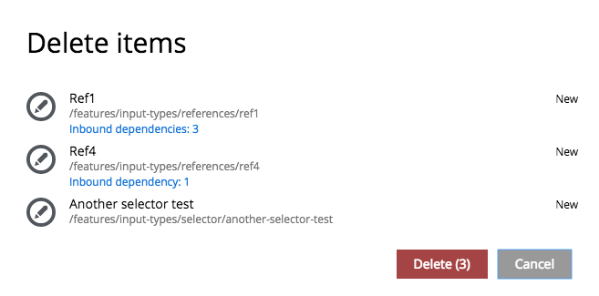
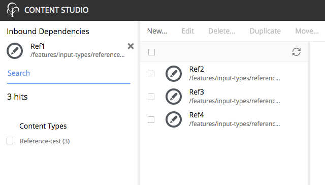

.. _delete:

Delete
======

.. NOTE::
   This page is under construction. This information is likely incomplete and possibly inaccurate until this notice is removed.

Content can be deleted using the **Delete item** dialogue. This dialogue can be accessed by the **Delete** button in the toolbar of both
browse view and edit view. It can also be opened from the context menu by right-clicking a content in the tree grid. The selected content is
listed along with its status. If the content is a parent then the children contents are listed and will also be deleted.
The Delete button shows the total number of items that will be removed. More than one content can be selected for deletion from the tree
grid in browse view.

**Offline** content is removed immediately. Content that is **online** can be removed immediately by checking the box labeled "Instantly
delete published items". If this box is not checked then the content will only be marked for deletion. Its status will change to **pending
delete** and its name will have a line through it. Content that is pending delete will still be visible outside the Content Studio. Content
that is pending delete can be removed and taken offline by publishing or unpublishing it, or deleting it again and checking the box to
"Instantly delete published items".

.. image:: images/delete-item-dialogue.jpg

If a content item that is about to be deleted has any incoming references (other content items that depend on it), this will be shown under
the item's path inside the dialog in a form of "Incoming dependencies: X", where X is a number of references.

A click on the "Incoming dependencies: X" will open a new tab displaying the content grid with only the references of the selected content item
to make it easy for the user to delete them or unlink them from the item to be deleted.

An extra layer of protection kicks in before multiple items or a **site** content can be deleted. The "Confirm delete" dialogue appears to warn
that this action cannot be undone. The number of content items to be deleted must be entered before the deletion will occur.

.. image:: images/confirm-delete.jpg