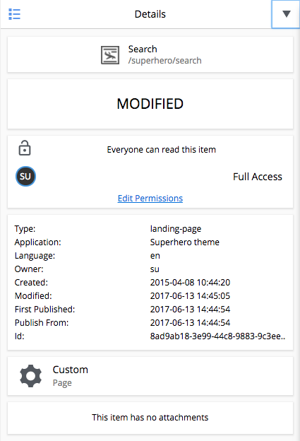
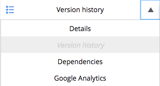

.. _detail_panel:

Detail panel
============

.. |detailicon| image:: images/icon-detail-panel.png
.. |unlockicon| image:: images/icon-unlock.png

The detail panel displays built-in and custom widgets with information about the content, selected in the tree grid.
To see it, click the |detailicon| button in the top right corner.  This reveals the panel selector, which by default show details about
the content.  The details are split into several boxes that show:

* Icon, name and path of selected content

* Content status (Online, Offline, or Modified)

* Permissions:  The permissions section has three parts.  First it shows an unlock icon |unlockicon| if the content has the role **Everyone**, which means the content is viewable without authentication. Second, it lists the users that have access to the selected content at each access level, for example, "Can Read" or "Full Access". Third, it has a link to edit permissions if the logged in user has the **Content Manager Administrator** role or other applied permissions to edit the content.

* Basic information about the selected content, including type, application, language, owner, timestamps and ID

* Rendering Mode, which reveals if the content is rendered by a custom built page, a specifically selected page template, or an automatically selected page template.

* File attachments

Widget selector
---------------

The dropdown menu on the top is a **widget selector** control with the installed widgets listed. In addition to the **Details** widget,
the **Version history** and **Dependency** widgets are built-in.
Others can be added with the Applications admin tool.
When a widget is selected, everything below it in the details panel is replaced with
whatever the widget is designed to display. To the left of the widget selector the |detailicon| button is available to hide the detail panel.

.. tip:: Widgets are user-definable. Read more about how to create your own :ref:`widgets`.

