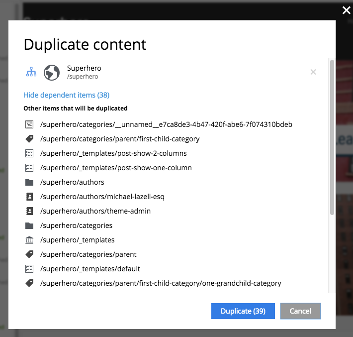

.. _duplicate:

Duplicate
=========

If you want to duplicate one or more content items, select them in the Content Grid and click Duplicate button in the Grid toolbar.
This will open modal dialog where you can choose whether child items of selected content(s) should also be duplicated or not.
Pressing "Duplicate" button in the dialog will trigger the duplicate operation which will be visualised by a progress bar, if the process is taking more than a few seconds.
Duplicates will get a new id and path names will be postfixed with "-copy".

When the Duplicate button is clicked from inside the Content Wizard, only the current item will be selected in the dialog.

