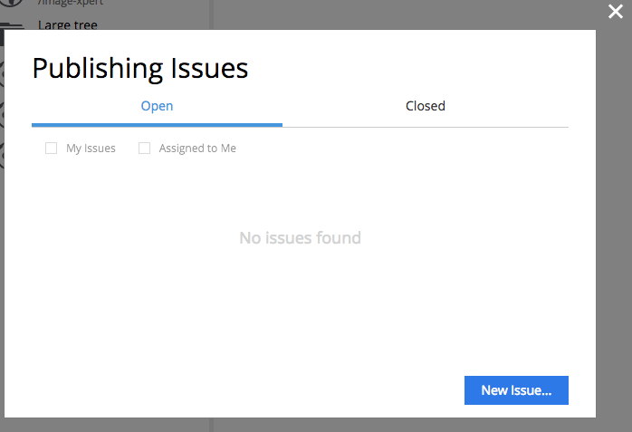
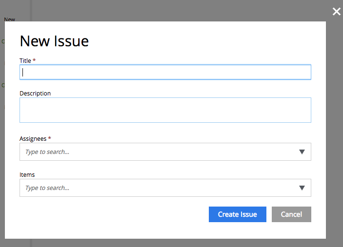
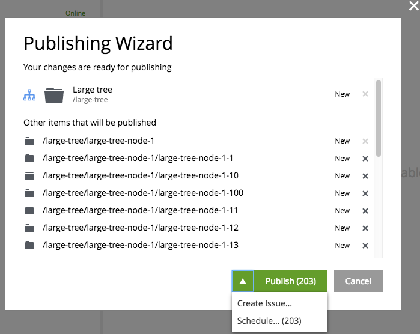
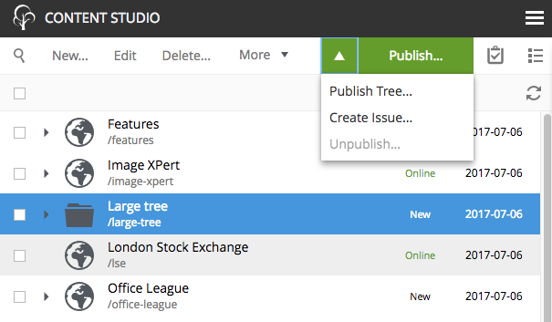
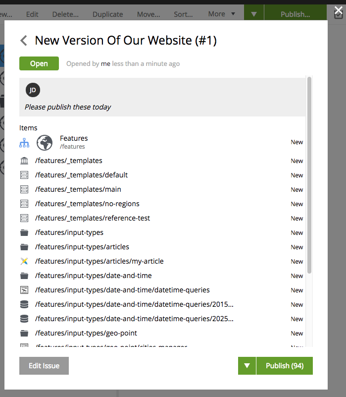

.. _issue_create:

New Issue
=========

There are several ways to create a new issue.

From the Issue List dialog
--------------------------

Click the |issueicon| icon in the top right corner of the :ref:`browse_view`. This will open a dialog with the :ref:`issue_list`.

In this dialog click the "New Issue" button to open the "Create Issue" dialog.

Fill out title and description of the new issue, select one or more assignees and content that is supposed to be published within the issue.
Use the |includechildrenicon| icon to flag content items that must be published with all of their child items. Use "X" icons in the list
to exclude items that should not be published within the issue.

.. image:: images/issues/publishing-issues-new-issue.png

Click "Create Issue" button to create the issue or "Cancel" to return to the list.

From the Publishing Wizard
--------------------------

Inside the Publishing Wizard you can expand the Publish button's dropdown menu and select "Create Issue" option.

This will open the "Create Issue" dialog similar to the one above except that the list of content items will be based on selection in the "Publishing Wizard".
Use |backicon| in the top left corner of the dialog to return to the Publishing Wizard if you want to make changes to the list of contents.

From the Publish button menu
----------------------------

In the Content Grid select content items that you want to add to a new issue. Expand the dropdown menu of the Publish button in the grid's toolbar
and select "Create Issue". Again, this will open the "Create Issue" dialog with preselected items from the grid selection.

No matter which way was used to create a new issue, once it was successfully created the user will be redirected to the :ref:`new issue's details dialog <issue_details>`:

After a new issue is created, both creator of the issue and all of the assignees will be notified by email.
