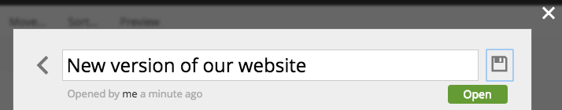

.. _issue_details:

Issue Details
=============

.. |backicon| image:: images/issues/icon-back-to-dialog.png

The dialog with issue details opens from the :ref:`issue_list` or via direct link from an email confirmation sent to assignees.
It will also open automatically after a new issue is created.
Use |backicon| in the top left corner to go back to the :ref:`issue_list`.
By pressing the pencil icon next to the issue title you will switch the title to edit mode and be able to edit it.

The dialog has three tabs: Comments, Items and Assignees.

Comments
--------

The first tab of the Issue details dialog shows the list of comments. If the issue was created with the description it will be listed as the first comment.
Each comment has a menu icon where you will find buttons to edit or delete the comment. You can add a new comment by typing in text into the textfield at the bottom
of the tab and pressing the "Add Comment" button.
"Close Issue" button will close the issue without publishing it.

Items
-----

On the second tab of the Issue details dialog you will find the list of content items and their dependencies. You can modify the list by adding new content to the issue
or removing existing items from the issue. By clicking the "Publish & Close Issue" you will publish all of the items with dependencies and the issue will be closed. You
can schedule publishing using the Publish button's dropdown menu.

Assignees
---------

The "Assignees" tab shows the list of users that the issue was assigned to. Each assignee will receive an email about new comments or changes in the issue.

