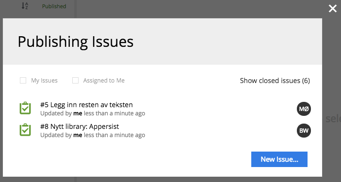

.. _issue_list:

Issue List
==========

.. |issueicon| image:: images/issues/icon-publishing-issues.png

The list of Publishing Issues can be opened by clicking the |issueicon| icon in the top right corner of the :ref:`browse_view`.

The list is split in two tabs: Open and Closed, with open and closed issues respectively.
Filter on top of the list can be used to narrow down the list to only the issues assigned to you or created by you.
Black circles next to each issue indicate assignees the issue is assigned to.
Clicking an issue will open the :ref:`issue_details` dialog.
"New Issue" button opens the :ref:`New Issue dialog <issue_create>`.
