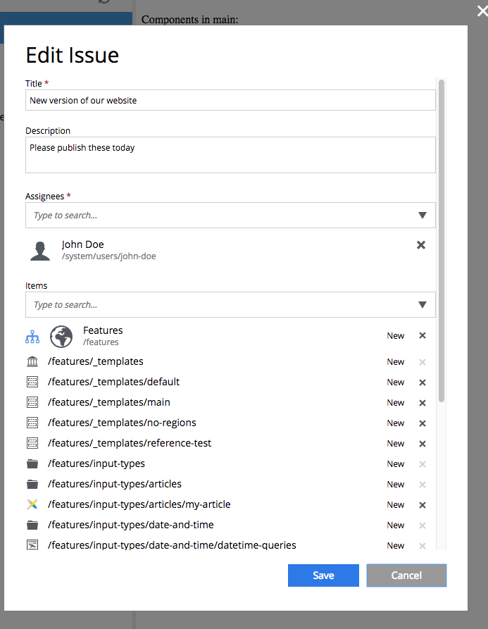

.. _issue_modify:

Edit Issue
==========

An issue goes into edit mode with a click on the Edit Issue button in the :ref:`issue_details` dialog.

Here you can change issue properties, assignees, the list of contents etc.
Click "Save" button to apply the changes or "Cancel" to close edit mode without changes.
After an issue is modified, both creator of the issue and all of the assignees will be notified of the changes by email.
