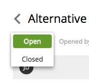

.. _issue_status:

Issue Status
============

Status of an issue can be changed from Open to Closed or back at any time by clicking the status button in the
:ref:`issue_details` dialog. This will expand a dropdown with available statuses - select one and the issue will be updated at once.
As always after issue modifications, an email will be sent to both creator of the issue and all of the assignees to notify them of the changes.

Note that changing issue status will change its location in the Issue List - it will be moved from Open tab to Closed tab or the other way around.

