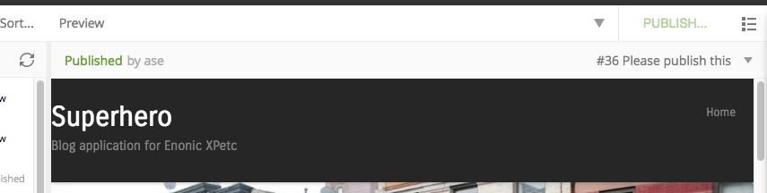

.. _preview_panel:

Preview panel
=============

A preview of the selected content appears in the right-hand panel of the Browse View if **page template** supports the type of content selected. This
is a working preview so links will take you to other pages and highlight the new page content in the content tree grid. The **Preview**
button in the toolbar will open the page in a new browser tab. When more than one content is selected in the content tree grid, the preview
panel is replaced with a list of all selected content items. If preview is for some reason unavailable the panel will indicate the reason with a message.

.. NOTE::
   Only the **Draft** version of content is visible in the preview panel.

Preview panel has a toolbar which shows status and last modifier of the content, as well as the list of open publishing issues the content is currently a part of. The newest issue
is shown by default and the entire list can be expanded via dropdown. Clicking on the issue name will open the :ref:`issue_details` dialog.

