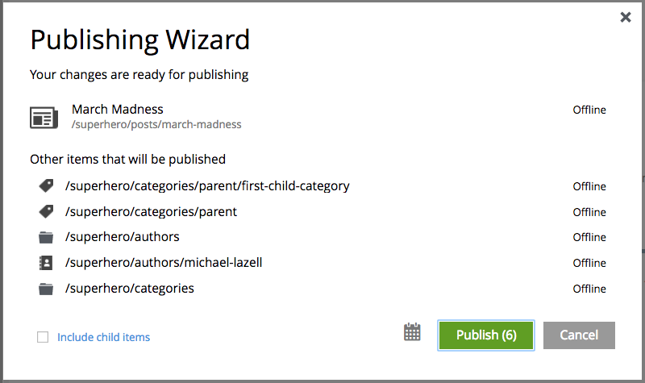

.. _publish:

Publish
=======

**Publishing** is a simple but important concept for working with content in Enonic XP. The basic concept of publishing is that it makes
content viewable to others outside of the Content Studio.

Draft and master branch
-----------------------

All content created with the Content Studio exists in the **draft** branch with the status **offline**. Content in the draft branch can be
edited, changed, and previewed until it is ready to go online. Every time a content is saved with changes, a new version is created. (See
:ref:`version_history`) When a content is published, the active version is copied from the **draft** branch to the **master** branch. Only
content in the master branch can be accessed by others outside of the Content Studio, subject to the contents' security settings.

Content status
--------------

Published content will have the status **online** while content that has not yet been published will be **offline**. When changes to a
published content are saved, the new version becomes the active version but the version that is online is not changed. The status of the
new active version will be **modified** and this content will need to be published again before the changes will be visible outside of the
Content Studio.

When a published content is "deleted", the "Delete item" dialogue offers a checkbox to "Instantly delete published items". If this box is
not checked then the content's status will be **pending delete** and it will still be visible outside of the Content Studio. Content that is
pending delete must be published, unpublished, or "instantly deleted" before it is actually removed from the master branch.

.. _publish_wizard:

Publishing wizard
-----------------

Content is published through the **Publishing Wizard** dialogue. When a content is selected for publishing, its parents and all the related
content will be published with it. For example, in the image below, a **Post** content named "March madness" was selected for publishing.
This post has two related **Category** contents and a related **Author** content. Therefore, the categories and author will be published
with the March Madness post and the parent folders of the categories and author will also be published. All items that will be published
with the selected content are listed in the publishing wizard.

If the selected content has children then these items can be included by checking the box labeled "Include child items". The total number of
items that will be published is displayed on the **Publish** button. The green "Publish" button has a menu option for "Publish tree" which
simply opens the dialogue with the "Include child items" box checked.

Schedule publish
----------------

During the publish of **offline** contents, the user has the possibility to specify the period of time during which the contents will be
available online. By default, the period starts from the time of the publish and has no expiring time.
This allow the user to schedule a publish by specifying an "Online from" date/time in the future and, optionally, an expiring date/time.
The content status of published contents that are not yet available or not available anymore will have the additional mention "(Pending)"
or "(Expired)".

.. note:: Changes to online items will be effective immediately - i.e. modified, moved, deleted.

.. image:: images/schedule-publish.png

Unpublish content
-----------------

Previously published content can be taken offline with the "Unpublish" feature. The "Unpublish" dialogue can be opened from the Publish menu
in the toolbar or by right-clicking the content in the tree grid and selecting "Unpublish" from the context menu. All of the content's
children will be listed and unpublished along with the selected content. The total number of content items that will be taken offline will
appear in parenthesis in the red "Unpublish" button at the bottom of the dialogue.

Content that has the status **Pending delete** will be removed and taken offline when unpublished.

.. image:: images/unpublish-dialogue.jpg
