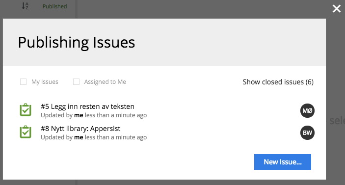

.. _publishing_issues:

Publishing Issues
=================

.. |issueicon| image:: images/issues/icon-publishing-issues.png

**Publishing Issues** is a way to create, delegate and follow up tasks for publishing one or several content items.
The list of publishing issues can be open by clicking |issueicon| icon in the top right corner of the :ref:`browse_view`.
A new issue can be created either from the Issue List dialog, :ref:`publish_wizard` or from the Publish button's menu in the Browse view's :ref:`toolbar_browse`.

If current user has any open issues assigned to him this will be reflected on the Issue icon: |notificationicon|.

.. toctree::
   :maxdepth: 1

   issue-create
   issue-list
   issue-details
   issue-status
