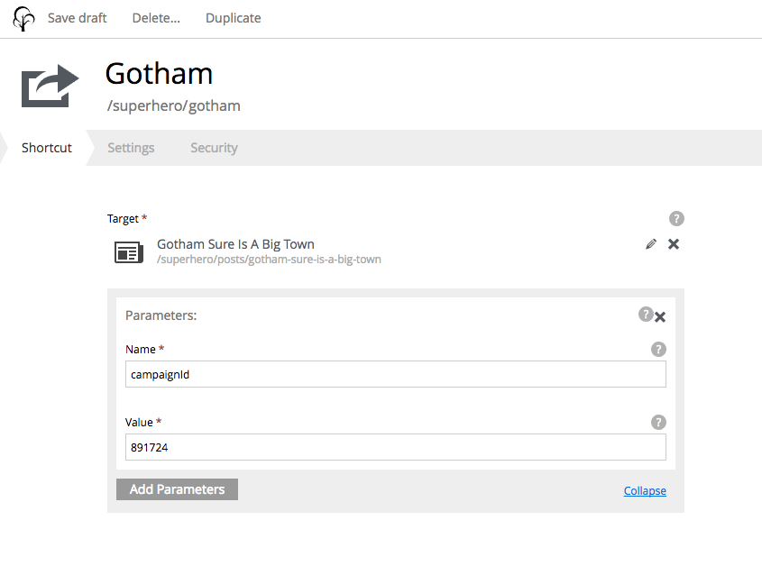

.. _shortcut:

Shortcut
========

Shortcuts create a content path that will redirect to another content. This allows a content deep inside a site to be accessed with a short
URL.

For example, a content in the "Posts" folder named "Gotham sure is a big town" would normally be reached at a URL with
``superhero/posts/gotham-sure-is-a-big-town``. But a shortcut as a first child of "Superhero" would make it available at
``superhero/gotham``.

Each shortcut has a required **Target** field. The selected target content can be edited with the pencil icon.

In addition it is possible to set custom parameters as a list of name-value pairs. These optional parameters will be added to the redirect URL.

