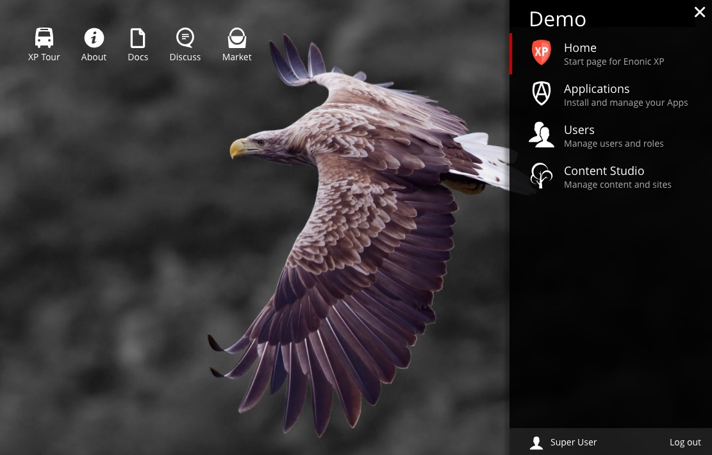

.. _home_tool:

Home
====

Upon successful login, user is redirected to the Home page. The collapsible **Launcher Panel** will automatically expand from the right-hand side.

The icons on the Dashboard can be used for the following:

* **XP Tour** starts interactive welcome guide through the main sections of the Enonic XP

* **About** opens dialog with current version of XP and a few helpful links

* **Docs** opens latest Enonic documentation

* **Discuss** opens Enonic forum where you can send questions to Enonic team

* **Market** opens Enonic market where you can download apps, widgets etc. for the Enonic XP

Future releases will include more functionality for the Home Tool.

Launcher panel
--------------

The **Launcher panel** lists the installed admin tools in alphabetical order. These will open in a new tab when selected, but a long
left-click will open the selected tool in the same tab. The bottom of the Launcher Panel shows current user and the logout button.

.. tip:: Admin tools are user-definable. Read more about how to create your own :ref:`tools`.
