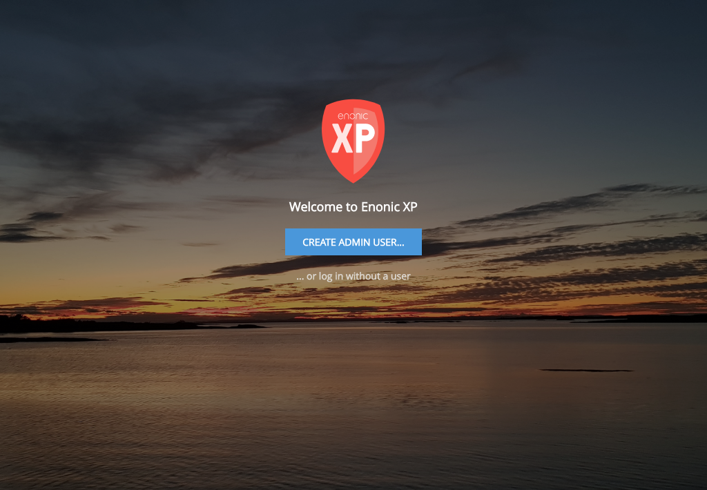

Admin Guide
===========

.. |menuicon| image:: images/icon-menu.png

This documentation describes the various administrative tools that are included in Enonic XP by default.

When visiting the Enonic XP admin interface - you will be required to log in.
For new installations and unless configured otherwise, you will first have to create the admin. user.

**Language**

   The tools of the admin console have been translated to the following languages:

   * English
   * French
   * Norwegian
   * Polish
   * Portuguese
   * Russian
   * Spanish
   * Swedish

   When using the admin console, your browser settings will be checked.  If your preferred language is one of the above, it will be used.
   If your preferred language is not in the list, the admin console will default to English.

   If you know a language that is not supported, we would greatly appreciate help with translating the admin console to more languages.
   Please checkout out our guide on :ref:`language_contribution`.

**The tools:**

.. toctree::
   :maxdepth: 1

   home
   contentstudio/index
   applications/index
   users/index
