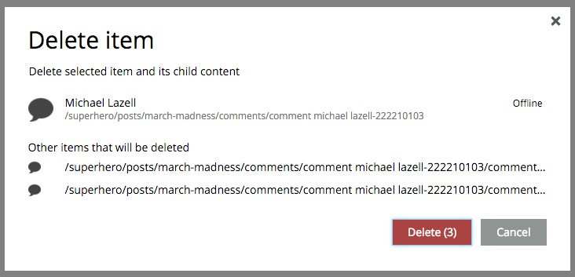
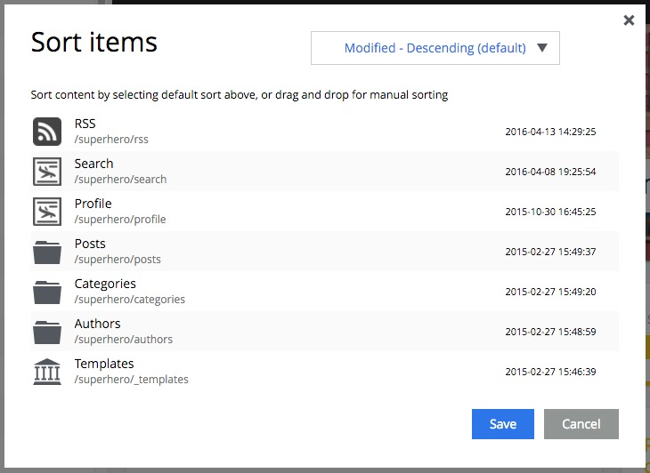
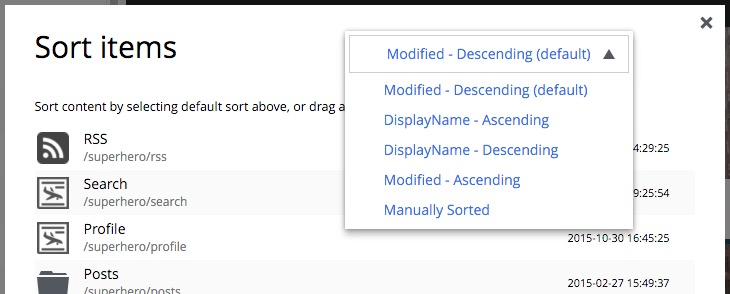
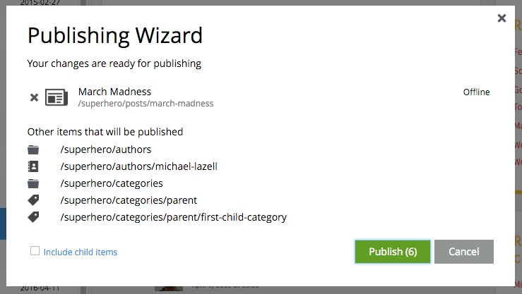

.. _cs_actions:

Actions
=======

.. NOTE::
   This page is under construction. This information is likely incomplete and possibly inaccurate until this notice is removed.

The menu bar in the browse view has buttons for New, Edit, Delete, Duplicate, Move, Sort, Preview and Publish. These options are also
available in the context menu that appears when right-clicking on a content in the tree grid panel.

New
---

Opens the :ref:`create_content_dialogue` for creating new content.

Edit
----

Opens the content in a new internal tab with **Edit view**. If the content type has a supporting page template then the **Page Editor**
panel will open as well.

Delete
------

Opens the **Delete item** dialogue for the selected content. The selected content is listed along with its status, Online or Offline. If the
content is a parent then the children content are listed and will also be deleted. The Delete button shows the total number of items that
will be removed. More than one content can be selected for deletion. If a content is **online** then it can only be marked for deletion.
Content that is marked for deletion will have a line through it and such content must be published before it is actually taken offline.

Duplicate
---------

This action will make a copy of the selected content and add "-copy" to the duplicate's path name. The only other difference between the
original and duplicate will be the content ID. Even the **Created** and **Modified** dates will be the same. This option is disabled when
more than one content is selected in the tree grid.

.. image:: images/duplicate.jpg

Move
----

Opens the **Move item with children** dialogue. This feature moves selected items with all children and current permissions to another place
in the tree grid. Type to search, or use the dropdown arrow, to find the new parent content where the selected items will be moved to. If
the "Move" button is clicked without choosing a parent content then the items will be moved to the root of the content tree. Content cannot
be moved to a location where another content already exists with the same path name.

.. image:: images/move-content.jpg

Sort
----

Opens the **Sort items** dialogue where child items of the selected content can be sorted.

The default sorting is by the **modified** time in descending order. The other options are **modified** time ascending, **DisplayName**
(ascending or descending), and **Manually Sorted**. To manually sort items, simply drag and drop them in the **Sort items** dialogue.

Once items are sorted, the parent content will have an arrow in the tree view pointed up or down to denote ascending or descending. If the
content is manually sorted, an icon with three horizontal bars will appear. Clicking the bars or arrow icon will open the **Sort items**
dialogue. In the image below, the Templates folder has manual sorting and the Posts folder is sorted by DisplayName descending.

.. image:: images/sorted.jpg

Preview
-------

This button will open the selected content in preview mode, in a new browser tab. If more than one content is selected, each will open in
its own tab. Only content that has a supporting page template can be previewed. Read more about :ref:`page_templates`.

Publish
-------

Opens the **Publishing Wizard** dialogue. All content created with the Content Studio exists in the draft branch where it can be edited and
previewed until it is ready to go online. Publishing a content moves it from the **draft** branch to the **master** branch where it can be
accessed by others according to the content's permissions.

When a content is selected for publishing, its parents and all the related content will be published with it. For example, in the image
above, a **Post** content named "March madness" was selected for publishing. This post has two related **Category** contents and a related
**Author** content. Therefore, the categories and author will be published with the March Madness post and the parent folders of the
categories and author will also be published. All items that will be published with the selected content are listed in the publishing
wizard.

If the selected content has children then these items can be included by checking the box labeled "Include child items". The total number of
items that will be published is displayed on the **Publish** button.

.. warning:: Once a content is published, it cannot be taken offline except by deleting it and then publishing the deleted item.
