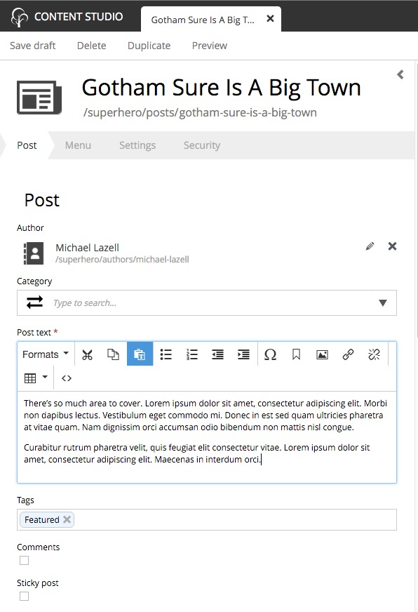
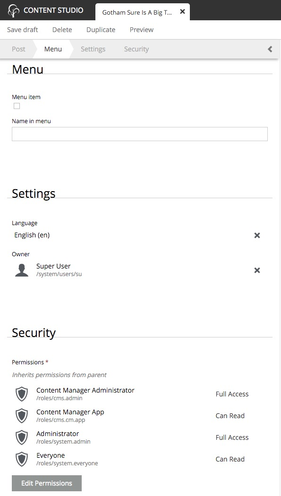

.. _content_editor:

Content Editor panel
====================

.. NOTE::
   This page is under construction. This information is likely incomplete and possibly inaccurate until this notice is removed.

This is where the form appears in which content data is entered. The structure and fields in the form are determined by the **content type**
which is defined in the application code. The panel can be collapsed to give the page editor more room.

The top of the content editor panel has the content type icon, the Display Name, and the content path name. The default icon can be replaced
with an image file by clicking on it. As the Display Name is entered, the path name will automatically be filled in with a URL-friendly
version. The path will not update automatically once the content has been published. This is to prevent accidental breaking of hard-coded
links. The path name can always be changed manually. It is also possible for the Display Name to be generated automatically while other
fields in the form are filled in if the content type was set up that way in the application code.

Next is a ribbon with buttons that correspond to different sections of the content form. All content will have buttons for the content type
name, **Settings**, and **Security**. Other items may be in the ribbon if x-data was added to the content type in the application code.
Clicking on an item in the ribbon will scroll the content editor to the corresponding section of the form.

The content data section is next and the form fields will depend on how the content type was set up.

The **Settings** area is where the content's Language and Owner are set. The **Language** will be inherited from the parent content if it
was set there. The Owner will be the logged in user who created the content, but it could be changed if the current user has the right
permissions.

The **Security** section is where the content's permissions are set. Content will inherit the permissions of the parent content when
created. Users, Groups and Roles can be added to the content. Clicking on any item here will expand the item and show what permissions the
principal has. Read more in the security section.