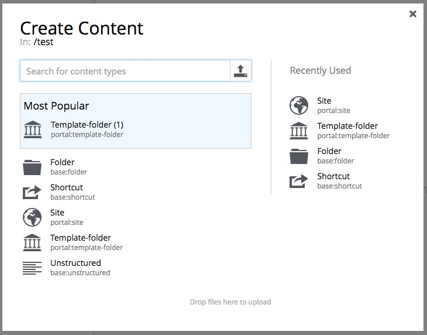

.. _conent_types:

Content Types
=============

.. NOTE::
   This page is under construction. This information is likely incomplete and possibly inaccurate until this notice is removed.

Some content types are built into enonic XP. A basic understanding of these will be essential to building sites with the Content Studio.

.. toctree::
   :maxdepth: 1

   folder
   shortcut
   site-content
   page-templates
   templates-folder
   unstructured
   image-content