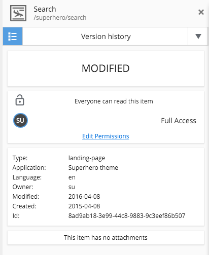

.. _detail_panel:

Detail panel and widgets
========================

.. |detailicon| image:: images/icon-detail-panel.png
.. |unlockicon| image:: images/icon-unlock.png

.. NOTE::
   This page is under construction. This information is likely incomplete and possibly inaccurate until this notice is removed.

This panel shows basic information about whichever content is selected in the tree grid. The content type icon is displayed at the top along
with the Display Name of the content and the content path.

Next is the **widget selector** control with the installed widgets listed in a dropdown. The **Version history** widget is built-in and
others can be added with the Applications admin tool. When a widget is selected, everything below it in the details panel is replaced with
whatever the widget is designed to display. To the left of the widget selector is a button |detailicon| that restores the detail panel.

.. image:: images/widget-selector.png

Next in the detail panel is the content status (Online, Offline, or Modified) followed by the permissions section. The permissions section
has three parts. First it shows an unlock icon |unlockicon| if the content has the role **Everyone**, which means the content is viewable
without authentication. Second, it lists the users that have access to the selected content at each access level, for example, "Can Read" or
"Full Access". Third, it has a link to edit permissions if the logged in user has the **Content Manager Administrator** role or other
applied permissions to edit the content.

The next part of the detail panel shows basic information about the selected content, including type, application, language, owner,
timestamps and ID. Finally, if the content has any file attachments, they are listed here.