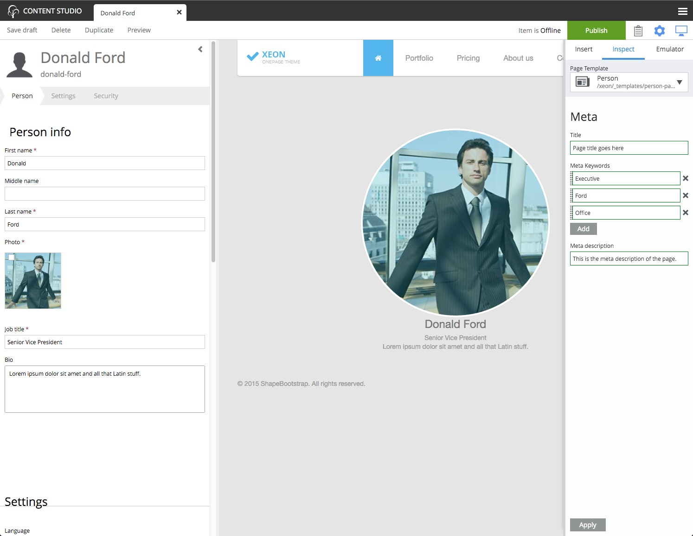

.. _edit_view:

Edit View
=========

.. NOTE::
   This page is under construction. This information is likely incomplete and possibly inaccurate until this notice is removed.

The **Edit view** exits as an internal tab within the Content Studio page. It appears when a content is created or edited. Multiple content
tabs can be open at the same time. Users can switch between tabs by clicking them. The :ref:`browse_view` can be reached by clicking the
words "Content Studio" at the top-left of the page and the content tabs will remain where they are. The tab will have a red circle with an
exclamation mark if the content is not valid due to missing required fields. Invalid content can be saved in the **draft** branch but it
cannot be published.

The edit view has several parts. On the left is the content editor panel. The center is where the page editor appears for content that has
a page template. The inspection panel is on the right.

.. toctree::
   :maxdepth: 1

   content-editor
   page-editor
   inspection-panel
   components-view
