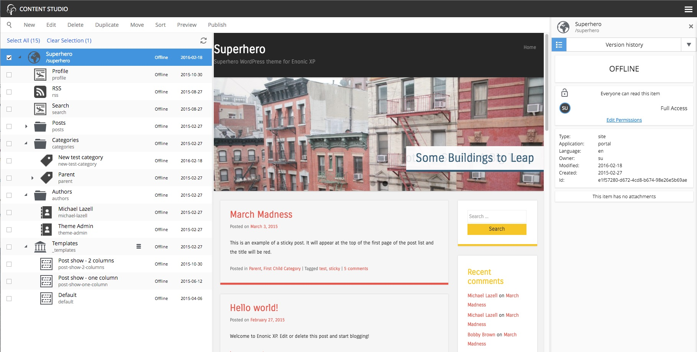

.. _content_studio:

Content Studio
==============

.. NOTE::
   This page is under construction. This information is likely incomplete and possibly inaccurate until this notice is removed.

The Content Studio is the Web CMS interface of Enonic XP. It is used for managing and publishing content. It also provides the tools for
building and extending web applications from the components of the installed apps. Opening the Content Studio reveals a menu bar on top and
three panels below it. On the left is the **content tree grid**, the center is a **preview panel**, and on the right is the **details
panel**.

.. NOTE::
   The Content Studio is fully responsive, so panels may stack or collapse if the screen is small or narrow. This
   documentation will assume a large desktop view.

.. toctree::
   :maxdepth: 1

   content-tree
   preview-panel
   detail-panel

