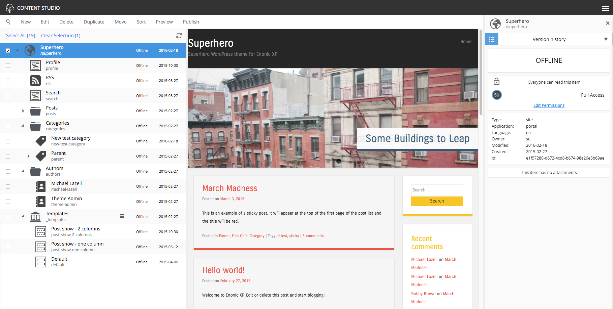
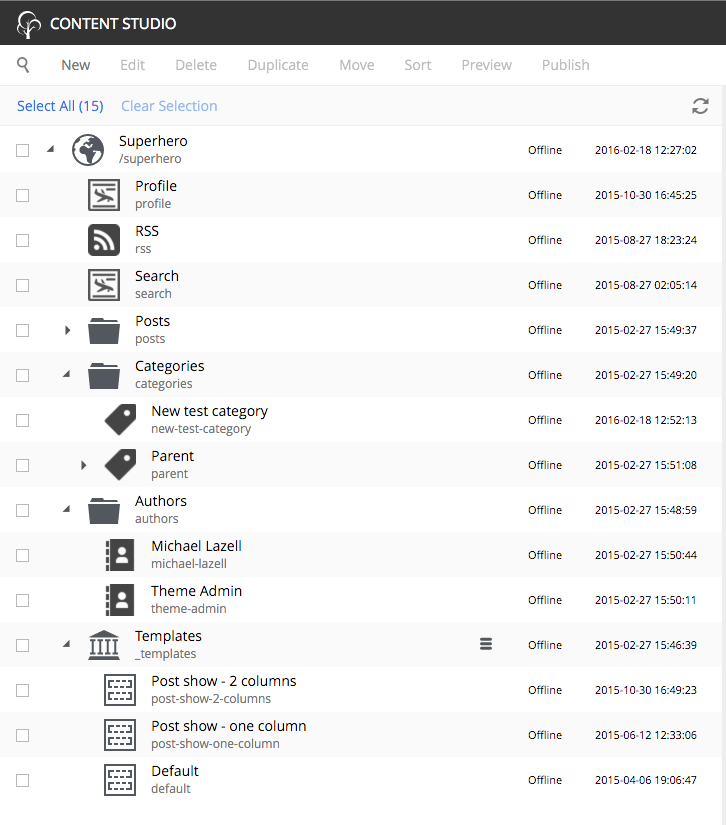

.. _content_studio:

.. |detailicon| image:: images/icon-detail-panel.png
.. |unlockicon| image:: images/icon-unlock.png

Content Studio admin tool
=========================

.. NOTE::
   This page is under construction. This information is likely incomplete and possibly inaccurate until this notice is removed.

The Content Studio is the Web CMS interface of Enonic XP. It is used for managing and publishing content. It also provides the tools for
building and extending web applications from the components of the installed apps. Opening the Content Studio reveals a menu bar on top and
three panels below it. On the left is the **content tree grid**, the center is a **preview panel**, and on the right is the **details
panel**.

.. NOTE::
   The Content Studio is fully responsive, so panels may stack or collapse if the screen is small or narrow. This
   documentation will assume a large desktop view.

Content tree grid
-----------------

The content tree lists all the content that the logged in user has `read access` to. Content can be organized and stored in a hierarchy with
child content collapsed under parent content. Parent content will have a gray triangle to the left of the content icon that can be clicked
to expand or collapse the view of its children. The content tree can also be navigated with the keyboard arrow keys. The top of the content
tree has buttons to select all displayed content, clear selected content and refresh the tree.

Information about the content is displayed in three columns. The first column has an icon based on the type of content. A gray triangle will
appear to the left of the icon if the content has children content. The first column also has a display name and under this is the path
name. The URL path to any content can be determined by following the tree grid path names from parent to child. The second column shows the
status of the content which will be Offline, Online or Modified. The third column shows the date that content was last modified.

Checkboxes to the left of each content in the tree can be used to select more than one content. Group actions available in the menu bar will
be performed on all the selected content. Some actions can only be performed on one content at a time.

Preview panel
-------------

A preview of the selected content appears in the middle of the page if a site **page template** supports the type of content selected. This
is a working preview so links will take you to other pages and highlight the new page content in the content tree grid. The **Preview**
button in the toolbar will open the page in a new browser tab. When more than one content is selected in the content tree grid, the preview
panel is replaced with a list of the selected content.

.. NOTE::
   Only the **Draft** version of content is visible in the preview panel.

Detail panel and widgets
------------------------

This panel shows basic information about whichever content is selected in the tree grid. The content type icon is displayed at the top along
with the Display Name of the content and the content path.

.. image:: images/content-detail-panel.png

Next is the **widget selector** control with the installed widgets listed in a dropdown. The **Version history** widget is built-in and
others can be added with the Applications admin tool. When a widget is selected, everything below it in the details panel is replaced with
whatever the widget is designed to display. To the left of the widget selector is a button |detailicon| that restores the detail panel.

.. image:: images/widget-selector.png

Next in the detail panel is the content status (Online, Offline, or Modified) followed by the permissions section. The permissions section
has three parts. First it shows an unlock icon |unlockicon| if the content has the role **Everyone**, which means the content is viewable
without authentication. Second, it lists the users that have full access to the selected content. Third, it has a link to edit permissions
if the logged in user has the **Content Manager Administrator** role or other applied permissions to edit the content.

The next part of the detail panel shows basic information about the selected content, including type, application, language, owner,
timestamps and ID. Finally, if the content has any file attachments, they are listed here.

