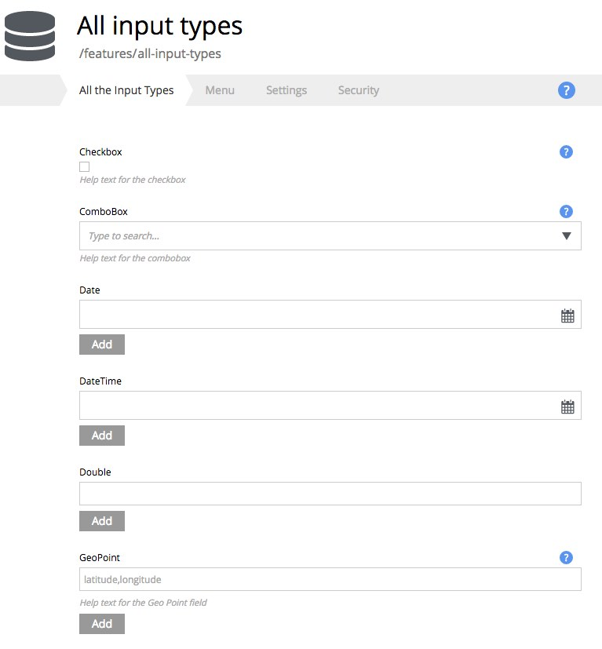

.. _editing_input_types:

Input types
===========

.. NOTE::
   This page is under construction. This information is likely incomplete and possibly inaccurate until this notice is removed.

Some of the input types will be familiar from standard web forms. Other input types are specific for editing content and configurations in
Enonic XP. Most inputs can be navigated and operated with the keyboard. Inputs can have their own configurations which are defined in the
application code and affect how they work.

All inputs have some common features. For example:

* Each input has a label.

* Each input can have an optional help text.

* Required fields are marked with a red asterisk.

* Input fields may be repeatable so that they can have multiple values. Repeatable inputs will have an **Add** button below the field.

.. toctree::
   :maxdepth: 1

   inputs-standard
   inputs-selectors
   inputs-text
   inputs-date-time
   inputs-numbers

.. image:: images/input-types.jpg

All inputs can have an optional help text that will be shown next to the input. It's hidden by default but can be turned on by clicking the "?" icon
next to the input label.

Note blue "?" icons next to the Checkbox and the GeoPoint fields in the form below - for these two fields the help text is turned on.
The ComboBox field also has a help text, but it's hidden - the "?" icon is inactive and must be clicked to show the help text.

.. image:: images/input-types-help-text.jpg

It's also possible to turn on help text for all inputs on the form at once by clicking the "?" icon inside the Content Wizard toolbar.

