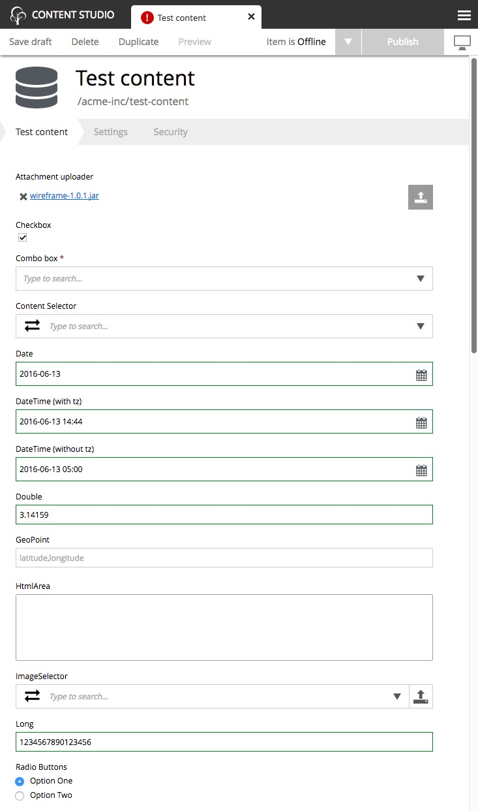

.. _editing_input_types:

Input types
===========

.. NOTE::
   This page is under construction. This information is likely incomplete and possibly inaccurate until this notice is removed.

Some of the input types will be familiar from standard web forms. Other input types are specific for editing content and configurations in
Enonic XP. Most inputs can be navigated and operated with the keyboard. Inputs can have their own configurations which are defined in the
application code and affect how they work.

All inputs have some common features. For example:

* Each input has a label.

* Required fields are marked with a red asterisk.

* Input fields may be repeatable so that they can have multiple values. Repeatable inputs will have an **Add** button below the field.

.. toctree::
   :maxdepth: 1

   inputs-standard
   inputs-selectors
   inputs-html
   inputs-date-time
   inputs-numbers

