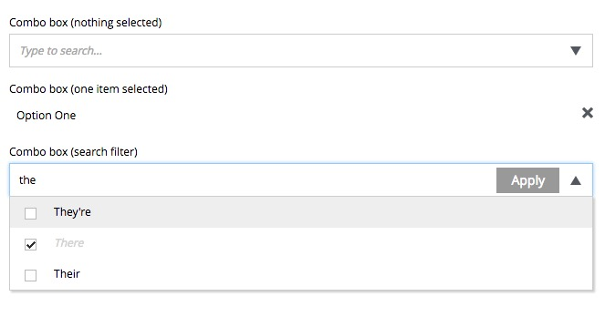
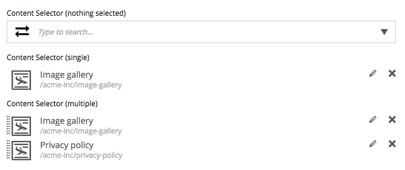
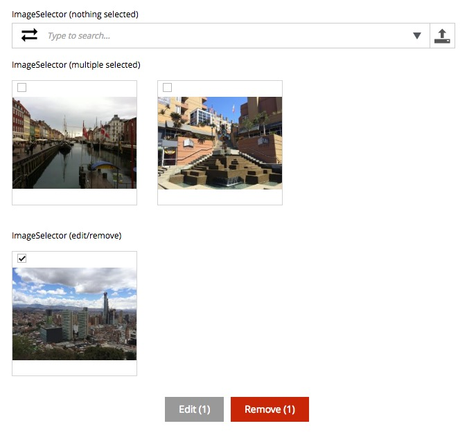
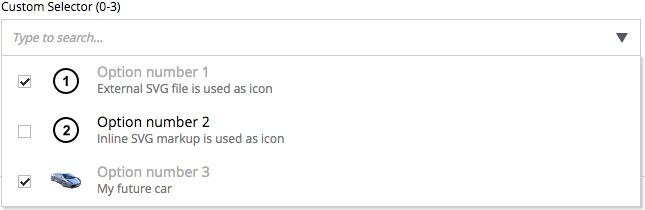

.. _editing_input_types_selectors:

Selector input types
====================

.. NOTE::
   This page is under construction. This information is likely incomplete and possibly inaccurate until this notice is removed.

These input types allow selections from a list of options.

Attachment uploader
-------------------

Files can be selected for upload with this input type. The uploaded files will exist as attachments to the content being edited rather than
as a content of their own.

Clicking the upload button to the right of the label will open your machine's native file browser where one or more files may be selected.
Attached files are listed by name and may be removed by clicking the X to the left. The files may also be downloaded by clicking the file
name.

.. image:: images/inputs-attachment.jpg

ComboBox
--------

This input type allows the selection of one or more predefined options. Clicking the down arrow in the right of the box will open a list of
options. Typing in the box will filter the options in the list.

If the input is configured for more than one selection then a checkbox will appear to the left of each option. The **Apply** button appears
in the box when changes are made and it must be used to accept the changes.

Selected options can be removed by clicking the X to the right of the selection text.

Content selector
----------------

Content selectors allow the selection of one ore more existing content items. They can be configured in the application code to list only
specific types of content and/or content that exists at a certain path of the content tree.

Content selectors behave much like combo boxes. The down arrow in the right of the box opens the list. Typing in the search field will
filter the content by name. When more than one content has been selected, the order my be changed by clicking and dragging the dotted area
to the left of each content. Any selected content may be opened for editing by clicking the pencil icon. Selected content can be removed
with the X icon.

Image selector
--------------

Image selectors are much like content selectors except that they allow only image content to be selected. They also allow new image content
to be created and selected by clicking the upload button to the right of the input. When multiple images are selected, the order can be
changed by clicking and dragging the image previews. Clicking on a selected image will reveal **Edit** and **Remove** buttons.

Tag
---

Tags allow the selection of previously entered tags and also allow the creation of new tag options. Start typing in the box to reveal
matching options. If the desired tag is found in the list, use the arrow keys or click to select it. If the desired tag has not been entered
before, simply finish typing and press **enter/return**. Added tags can be removed by clicking the X next to each tag.

.. image:: images/inputs-tag.jpg

Custom selector
----------------

Behavior of Custom selector is similar to that of Content selector except that the list of options in the dropdown is built based on user-
configured data source. In the application code user must create a service that returns JSON in correct format required by the input. Each
option in the JSON must have a unique Id and display name (required), and, optionally, description and thumbnail (either as an external URL
or inline SVG).

