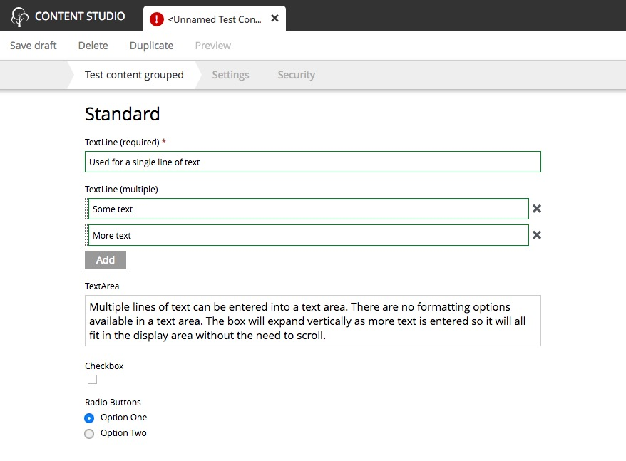

.. _editing_standard_input_types:

Standard input types
====================

.. NOTE::
   This page is under construction. This information is likely incomplete and possibly inaccurate until this notice is removed.

These are the familiar input types that are used all over the web. They function the same as you would expect.

TextLine
--------

A text line is used for capturing a single line of text. In the image below, the first TextLine is required and marked with a red star. The
second allows multiple entries under the same label. When multiple values are enabled, the order of the entries can be changed by clicking
the dotted area to the left of the entry box and dragging them up or down.

TextLine inputs may be configured with regular expressions to allow only valid values with a specified structure. The box becomes red when
the value does not match the regular expression.

TextArea
--------

The text area is used when the expected value to be entered is too large for a text line. Multiple lines of text are allowed. There are no
formatting options available for a text area. The box will expand vertically as more text is entered.

CheckBox
--------

The checkbox can be toggled between **checked** or **unchecked** by clicking the box or the label with the mouse or by pressing the space-bar when it has
focus. Checkbox position in relation to its label is configurable.

RadioButtons
------------

This type of input allows the user to select one of several options. When one option is selected, a previously selected option will be
unselected. The options can be navigated with the keyboard arrows.

