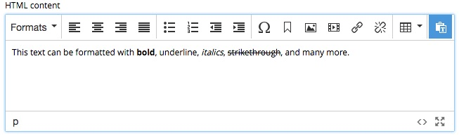

.. _editing_input_types_text:

Text HtmlArea
=============

.. NOTE::
   This page is under construction. This information is likely incomplete and possibly inaccurate until this notice is removed.

There are three input types for entering text. The Text Line and Text Area are covered in the :ref:`editing_standard_input_types` page. This
section will cover the HtmlArea.

The HtmlArea is a special input type that allows text to be formatted in various ways. Code and iFrames can be embedded with macros. Images
and content links can also be inserted. The editing features of the HtmlArea are the same for the Text component, except that the toolbar
for the text component appears at the top of the page.

Toolbar
-------

The toolbar has buttons for various formatting options as well as inserting things like pictures, links, special characters and more.

Formats
+++++++

The "**Fromats**" button opens a menu with submenus for **Headings**, **Inline**, **Blocks**, and **Alignment**.

The **Heading** submenu has options for turning a line of text into an Html heading. These options range from h1 (largest) to h6 (smallest).

The **Inline** submenu has options for converting text to bold, italic, underline, strikethrough, superscript, subscript and code. The code
option makes text monospace.

The **Blocks** submenu will wrap a block of text in HTML elements for Paragraph 
, Blockquote <blockquote>, Div 
, and Pre <pre>.

The **Alignment** submenu has options to align a block of text to the left, center, right, or justify.

Cut
+++

This button will remove the highlighted text and store it in the clipboard.

Copy
++++

The copy button will store the selected text in the clipboard.

Paste as text
+++++++++++++

The paste button is actually a toggle setting that controls how text is pasted. The icon is highlighted blue with the default mode which
removes the source formatting from text when it is pasted. Click the icon to change modes. With plain text disabled, any formatting applied
on the source of the text will come with it.

Lists
+++++

The next two icons will turn text into a bullet list or a numbered list. Pressing "enter/return" will make a new list item and pressing it a
second time will end the list. Use shift + enter/return to make a new line within the list item. A sub-list can be created with the indent
button.

Indent
++++++

The next buttons will decrease and increase indent for the selected text. These buttons will also increase or decrease the level of a list
item.

Special character
+++++++++++++++++

This button opens a menu with 250 special characters. Selecting one will insert it at the cursor's location.

Anchor
++++++

Anchors are places in the text that links can send the user to. If a link references an anchor on the same page then the page will scroll up
or down to the location of the anchor. The anchor button in the toolbar opens the **Insert Anchor** dialogue where the name of the anchor is
entered. The anchor name will be used as the value of the "id" attribute, so it should be lower case without spaces.

Insert image
++++++++++++

This button opens the **Insert Image** dialogue. An existing image content can be selected from the "Image" selector, or a new image can be
uploaded by clicking the upload button. Once an image is selected, some formatting options appear. The image can be floated to the left or
right so that text wraps around it. The image can also be centered or set to full width. A checkbox allows you to keep the image at its
original size. A **Cropping effect** selector has options for various aspect ratios. A caption can be entered at the bottom.

Insert macro
++++++++++++

This button opens the **Insert Macro** dialogue, which contains a selector for choosing a macro. Macros allow all sorts of things to be
inserted into the input, such as iframes, YouTube videos, Twitter Tweets, etc. There two built-in macros and others can be added with
applications. Once a macro is selected, a form appears with inputs for the macro's configuration settings.
