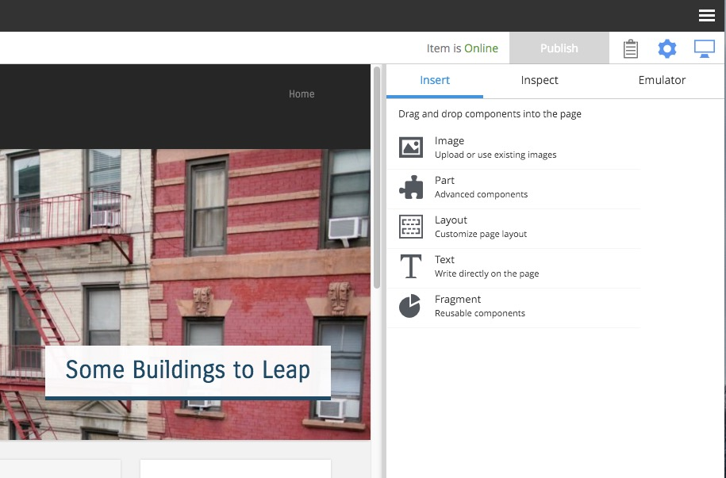

.. _inspection_panel:

Inspection Panel
================

.. NOTE::
   This section is under construction. This information is likely incomplete and possibly inaccurate until this notice is removed.

This panel is a multi-function tool that can be toggled open and closed with the cog icon at the right of the toolbar. It is used in
conjunction with the **Page Editor** to add and configure components on the page and to emulate various device sizes. The inspection panel
has three tabs: Insert, Inspect, and Emulator.

Insert tab
----------

This tab has a list of component types that can be added to the page in a two step process. The first step is to drag and drop a component
type placeholder to a region in the page editor. The second step is to select the specific component from a dropdown selector in the
placeholder.

For example, to add a part component called "Categories" to the page, simply click the part icon (puzzle piece) and drag it to a region in
the page editor. A red circle appears when the component is dragged over an area where it cannot be dropped. A green checkbox appears when
dragged over valid locations and a blue box shows where the component will land. Once the part placeholder is dropped, it will have a
combo-box where the "Categories" part can be selected from the list.

Inspect tab
-----------

This is where components are configured. The inspection panel displays form inputs matching the configuration of whichever component is
selected in the page editor. Some components won't have any configuration settings. The page will not update as configuration values change
until the content is saved or when changes are applied with the button at the bottom of the panel.

The inspect tab is also used for changing the default page template of a selected content and choosing a page component to render content
that does not have a supporting page template. Read more about this in :ref:`page_templates`.

Emulator tab
------------

This tab has buttons for emulating various sized devices. The page editor will shrink and expand to fit the selected device size.

.. image:: images/emulator.jpg
