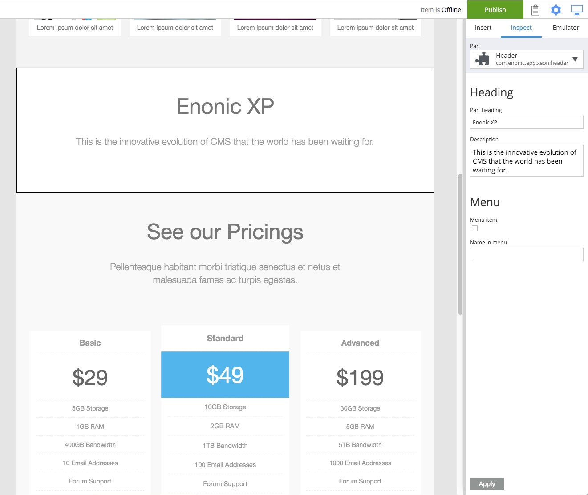

.. _page_editor:

Page Editor panel
=================

.. NOTE::
   This page is under construction. This information is likely incomplete and possibly inaccurate until this notice is removed.

The page editor is a modifiable preview of the content page. It is used in conjunction with the **inspect panel** to add, delete, and move
components around the page with drag and drop. When a content that has a supporting page template is created or edited, the page editor will
open on the right automatically. The page editor can be opened with the icon on the far right of the toolbar that looks like a computer
monitor.

Manually adding a page component
--------------------------------

The page editor will be closed when the type of content being edited does not have a supporting page template. Open it with the monitor icon
on the right of the toolbar. Use the dropdown selector to find the desired **page component** which will render a page. Use the **components
view** or the **inspect panel** to drag the desired components to the regions of the page.