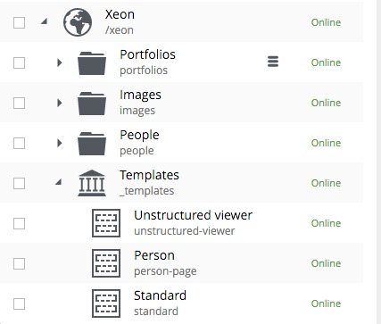
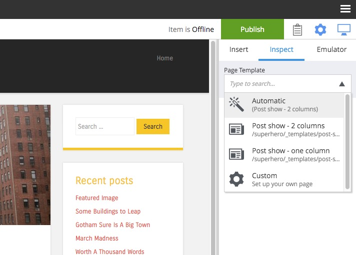
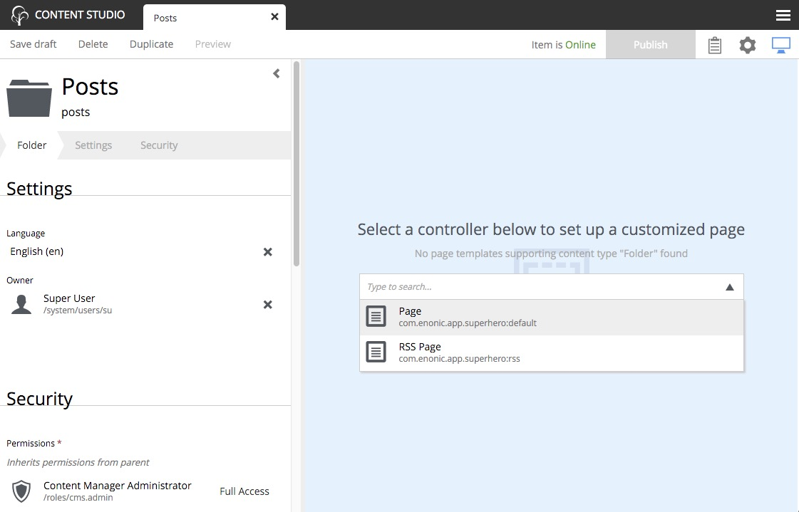

.. _page_templates:

Page Templates
==============

.. NOTE::
   This page is under construction. This information is likely incomplete and possibly inaccurate until this notice is removed.

Page templates are special content that enable other content to be rendered as pages. Page templates must support one or more content types.
When a request endpoint matches a content path, the content's supporting template will be used to render it. The :ref:`page_editor` is used
to build page templates by placing the desired components into regions on the page in the desired locations.

Page components
---------------

Page components are defined in the application code and contain the basic HTML structure of all rendered pages. Each page template uses one
page component. They usually contain the page header, footer and menu. Most page components will have one or more regions where other
components (parts, layouts, etc.) can be placed with the page editor. A single page component can be used by any number of page templates.

Creating page templates
-----------------------

Page templates are content that can only be created in a site's **Templates** folder. Create a new template content here and choose which
content types will use it for rendering with the dropdown selector labeled **Supports**. A dropdown selector on the right side of the page
is used for choosing the page component. Once a page component is selected, the page preview will be visible in the page editor. Use the
**inspect panel** or the **component view** to add components to the region(s) in the page.

Customizing content
-------------------

More than one page template can support the same content type. In this situation, the template that appears first in the Templates folder
will be used to render the content by default. But individual content can be manually configured to use any template that supports its type.
For example, in the image below there is a content type called "Post" and two templates that support the Post type,  first is "Post show - 2
columns" and then "Post show - 1 column". The "Post show - 2 columns" will be used automatically by all Post content. To force an individual
Post content to use the 1 column template, edit the content and select the 1 column template in the **Page Template** dropdown at the top of
the **Inspect panel**.

Individual content can also be customized to render differently. To customize a content, edit it and click anywhere on the page in the page
editor. A context menu appears with a "Customize" button. Once that button is clicked, components on the page can be moved with drag and
drop, or removed from the page and other components can be added.

Rendering other content
-----------------------

Even content that has no supporting templates can be rendered as a page. For example, if a site has a **Folder** content called "Articles"
and it has child **Article** content then it might be desirable to render the "Articles" folder as a page with a list of the articles that
it contains. This is achieved by adding a page component to the unsupported content with the page editor. Edit the content and open the page
editor. Select a page component from the dropdown selector and then add components (parts, layouts, etc.) to the page.

