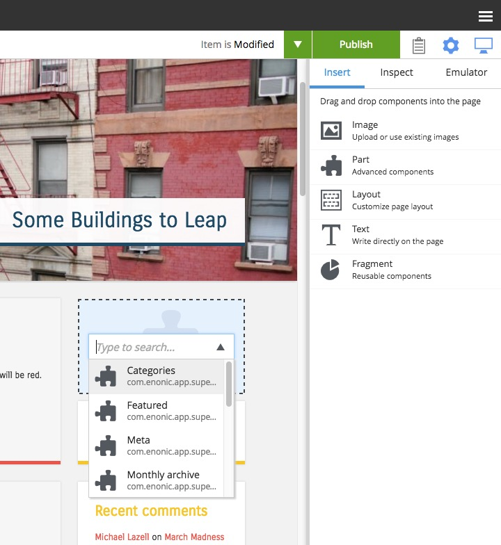

.. _cs_part_component:

Part component
==============

.. NOTE::
   This section is under construction. This information is likely incomplete and possibly inaccurate until this notice is removed.

Part components are reusable, configurable components that can be placed into any region of a page with the page editor
:ref:`inspection_panel`. This allows content editors to build and customize pages without writing any code. There are no built-in part
components. Each one is custom made in the application code. Parts are typically created to render custom content, lists of content, forms,
etc.

The first step in adding a part component to a page is to edit the page content and open the inspection panel's "Insert" tab. Drag the part
component placeholder (puzzle piece) to the desired location on the page. The part placeholder will now appear as a blue box with a dropdown
selector. The same part dropdown selector will appear in the inspect panel. Use one of the selectors to find the desired part component.
Once a part component is selected, the placeholder will be replaced with the actual part and the Inspect panel will show the part's
configuration options in a form.

Some parts won't have any configuration. Parts with configuration options are independently configured. This means that the same part
component can be added to multiple pages, or even multiple times in the same page, and each instance can have different configuration
values.

