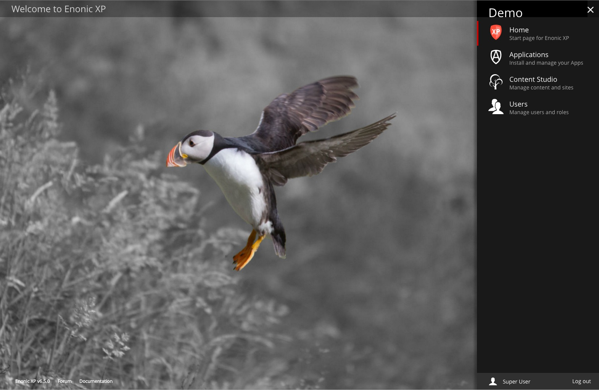

Admin UI
========

.. |menuicon| image:: images/icon-menu.png

.. NOTE::
   This section is under construction. This information is likely incomplete and possibly inaccurate until this notice is removed.

This section covers the Administration User Interface of Enonic XP. The Admin UI consists of built-in **admin tools** included with
Enonic XP, as well as any custom admin tools that may be added. Admin tools are listed in the **Launcher Panel** on the right, after
logging in. The admin tools launcher panel can be accessed from within each admin tool by clicking the menu icon on the
top right. Each admin tool will open in a new browser tab unless you hold down on the left-click button for one second.

The :ref:`application_tool` tool is used to install and manage XP applications. The :ref:`content_studio` is the Web CMS interface. It is
used for managing/publishing content and also building and extending web applications from the installed apps. The :ref:`users_tool` tool
allows the management of users, roles, permissions etc.

.. toctree::
   :maxdepth: 1

   home
   applications/index
   contentstudio/index
   users/index

