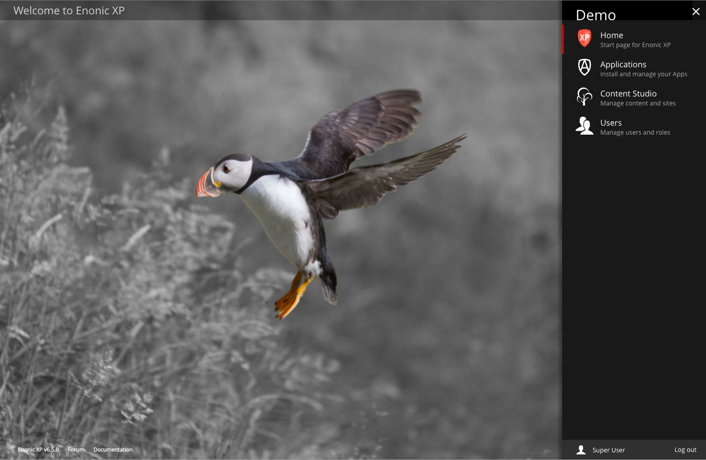

Admin Tools
===========

.. |menuicon| image:: images/icon-menu.png

.. NOTE::
  This section is under construction. This information is likely incomplete and possibly inaccurate until this notice is removed.

This section covers the built-in admin tools that are included with Enonic XP. These admin tools are listed in the panel on the right, after
logging into the admin page. The admin tools menu can be accessed from within each admin tool by clicking the menu icon |menuicon| on the
top right. Each admin tool will open in a new browser tab unless you hold down on the left-click button for one second.

The :ref:`application_tool` is used to install and manage XP applications. The :ref:`content_studio` is the Web CMS interface. It is used for managing/publishing
content and also building and extending web applications from the installed apps. The :ref:`users_tool` tool allows the management of users, roles,
permissions etc.

.. toctree::
   :maxdepth: 1

   applications/index
   contentstudio/index
   users/index

