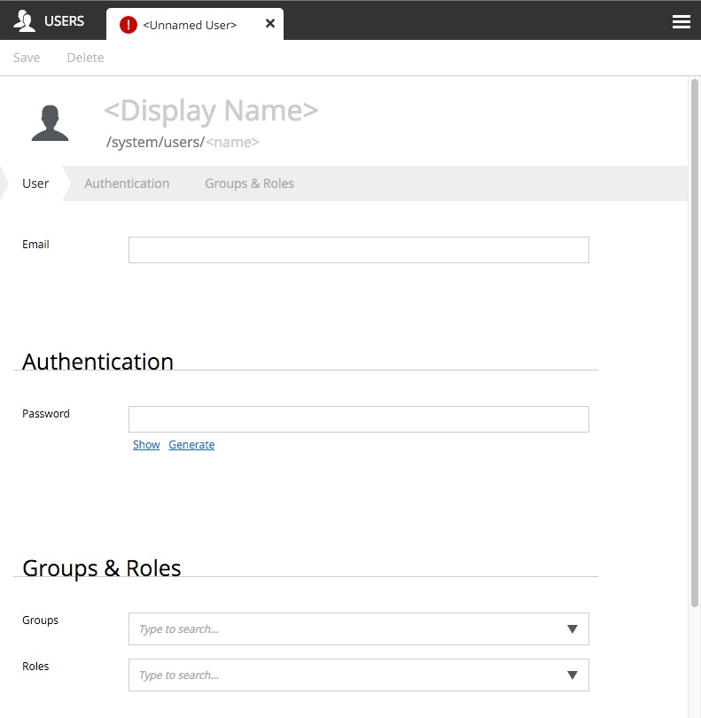

Userstores
==========

.. NOTE::
   This page is under construction. This information is likely incomplete and possibly inaccurate until this notice is removed.

All users and groups are created and managed in user stores. Each Enonic XP installation has a System User Store that cannot be deleted.
Additional user stores can be created as needed. For example, it might be convenient to use the System User Store for employees who run the
website and another user store for customers who log into the public site.


Users
-----

The System User Store has two built-in users. One is the Super User which has full administrative permissions. The other is the Anonymous
User which is the principal used by any site visitor that is not logged in.

Creating users
``````````````
Additional users may be added by right-clicking the "Users" folder and selecting "New" in the context menu. This opens the User editor in a
new tab within the page. All the fields are required except for the "Groups & Roles" and the user cannot be "Saved" until the required
fields are filled in.

The ``<Display Name>`` field will typically be the user's first and last name with capital letters and a space. The ``<name>`` field will be
automatically filled in with a URL-friendly version of the ``<Display Name>``. The ``<name>`` will be used to log in and it can be manually
edited at this time. The ``<name>`` cannot be changed once the entry is saved. The Email field must have a valid format and must be unique
per user store. The Password field has buttons to show/hide the characters and the "Generate" button will create a random password for you.
The password's strength will be displayed as you type and this ranges from "weak" to "extreme". Passwords cannot be displayed once the entry
is saved.

Groups and Roles can be added to the user now or while editing the entry later.

Once the required fields have valid values, the red exclamation mark in the tab goes away and the user entry can be saved by clicking the
button in the toolbar.



Groups
------

Groups assist with managing user permissions for content. For example, all content has security permissions which may include roles, groups
and users. If a content has only a group named "Customers" (with read access) then only logged in members of that group can see the content.
Groups have no function without Members. Users and even other groups may be added as members. Clicking on a group in the Users admin tool
will show the group's display name, principal path, and a list of its members.

Creating groups
```````````````

Right-click the "Groups" folder in the desired user store and select "New" in the context menu. The ``<Display Name>`` is what will be
listed in the "Groups" folder. The ``<name>`` is automatically generated as a URL-friendly version of the ``<Display Name>`` and should not
be changed. The Description is optional. Users and other groups can be added to the group as "Members". Users can also be added to a group
by editing the user.

.. image:: images/groups.jpg