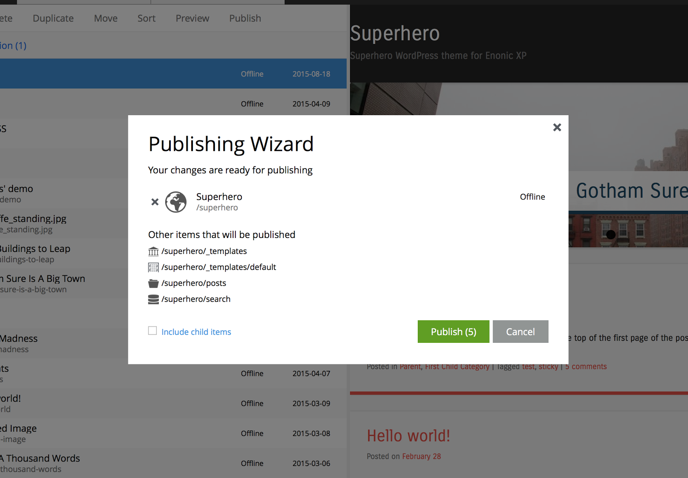

Notable 6.0 Changes
===================

Here's a list of some notable changes.

* Module is now application

What we called module is now called application. This change is
reflected everywhere. To convert an existing module to an application, some changes are needed in your module, please consult the :ref:`upgrading_to_6_0_0` chapter

* Publish wizard

A publish wizard that will guide you in the process of publishing content and dependencies between branches has been introduced. 

* JavaScript API changes

The Script commands used to access extra functions in the controllers have been replaced by libraries.
  
* Init App in toolbox

The toolbox command for 6.0 needs to get a new method that will initiate an application for Enonic XP. This will get your application ready for development without having to setup the application structure. See :ref:`init-app`

* Content app search improved

The search in the content app has been greatly improved, by improving partial matching and better fulltext matching and scoring.

