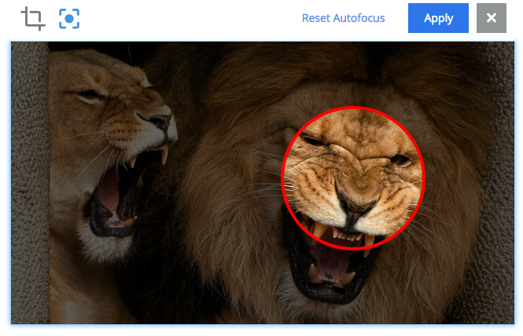

Notable 6.0 Changes
===================

Here's a list of some notable changes.

- **Module is now application**

What we called module is now called application. This change is
reflected everywhere. To convert an existing module to an application, some changes are needed in your module, please consult the :ref:`upgrading_to_6_0_0` chapter

----

- **Simplified application development**
  
  - `init-app`-task in toolbox will create a new application project structure for you
  
  - The XML descriptors for `parts` and `pages` are now optional

----
	
- **Publish wizard**

A publish wizard that will guide you in the process of publishing content and dependencies between branches has been introduced. 

.. image:: images/publish_wiz.png

----

- **Image crop and focus point edit**

It is now possible to crop an image in the Content Manager application. It is also possible to set a focus point to be retained when cropping images.

----

- **JavaScript API changes**

The Script commands used to access extra functions in the controllers have been replaced by libraries.
  
----

- **Content app search improved**

The search in the content app has been greatly improved. Especially with regards to partial matching and better fulltext matching and scoring.

