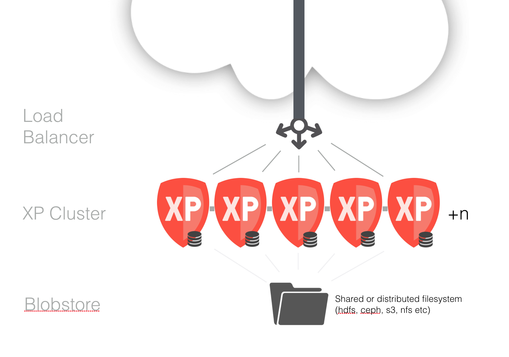
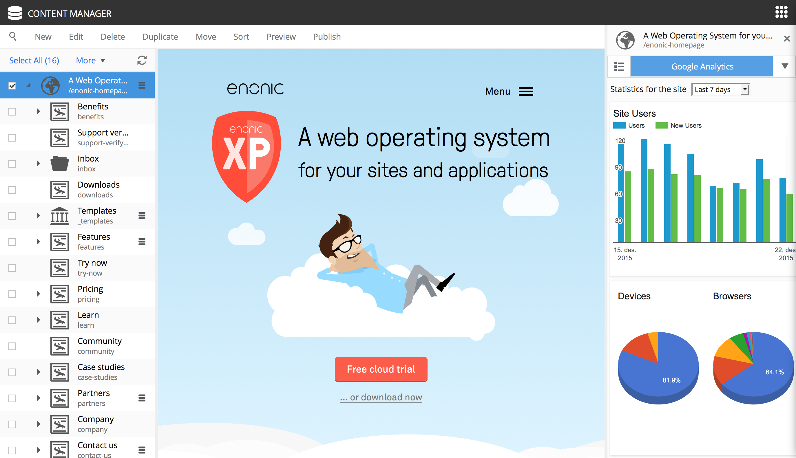

Release Notes
=============

Enonic XP |version| is a minor release, with several exiting new feature and fixes - there are no breaking changes

Clustering support
------------------
Enonic XP is now ready for production deployment in clustered environments. 
The clustering utilizes the distributed capabilities of the storage engine and features a new set of distributable events, so developers can easily communicate across cluster nodes. 
We have also created an extensive documentation for how to get started with :ref:`clustering`.

Happy scaling everyone :)

Pluggable Admin Widgets
-----------------------
Detail Panels (located in the Content Manager browse view) becomes the first part of the Admin UI to support pluggability.
Widgets are created similar to how you create parts and pages, they can easily be embedded inside any application. 
We use Web Components technology to isolate javascript and css code from the rest of the application, so you can write widgets in whatever technology you prefer. 

Read more on how to build a :ref:`widget`

Multipart handling in JS
------------------------
The servers-side javascript framework now supports handling of multipart requests. This allows you to handle any kind of files and binaries that are submitted along with a request.
Along with this new capability, a few new libraries for handling repository attachments and IO has been developed. These are shipped with this release.

New JS Libraries
----------------

* lib-cache (Create caches with Javascript)
* lib-io (Read, Write and parse files and binaries)
* lib-http-client (Integrate with remote http services)
* lib-context (Access and override context during request, i.e. execute commands as other users)
* lib-security (Access and modify content and node permissions)

Improved JS Libraries
---------------------

* lib-content now features attachment capabilities
* lib-auth now features capabilities for creating and modifying users

Hot-reload development mode
---------------------------
Enonic XP development just got even faster - The new "dev" mode allows for "real-time" coding where changes to scripts, xml-descriptors and assets are instantly available on the server without building and deploying.
To use the dev mode, launch Enonic XP with the "dev" option. 

.. note:: Changes to Java code, or removal of resources will still require building and deploying

Performance improvements
------------------------
Enonic XP now automatically caches both node data and application resources such as content-types and xml-descriptors, effectively reducing the number of disk accesses required. 
The cache is completely transparent and requires no invalidation or update delays

Minor improvements
------------------

* XP Admin now has for IE 11 and Edge support
* Path filtering option for selector input types
* Regular expression support for TextLine input types
* Status reporters for installation :ref:`monitoring`
* UI Launcher mode (starts Enonic XP in a native operating system window, to be used for future XP Installers)
* Standalone `Javascript reference documentation <http://repo.enonic.com/public/com/enonic/xp/docs/6.3.0/docs-6.3.0-libdoc.zip!/index.html>`_

Changelog
---------
For a complete list of changes see http://github.com/enonic/xp/releases/tag/v6.3.0
