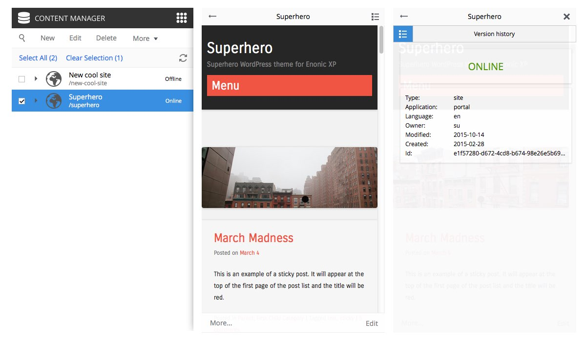
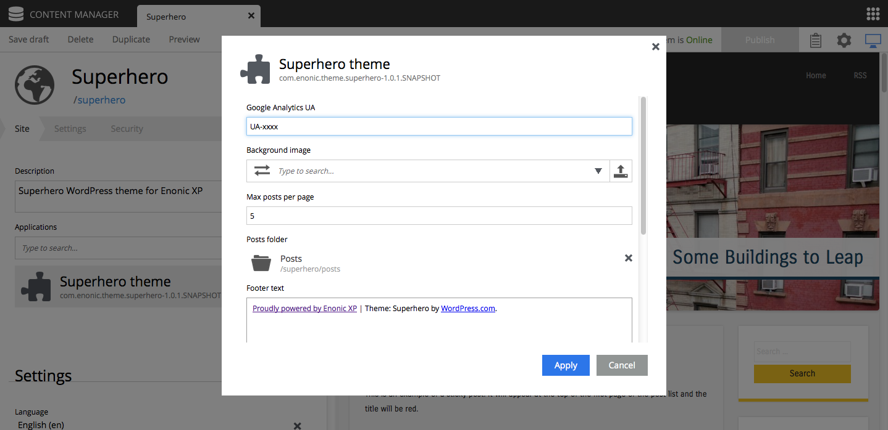
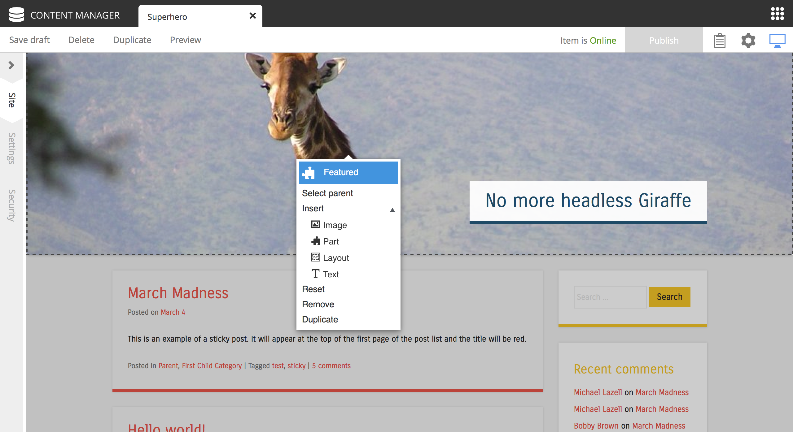

Release Notes
===================

Enonic XP |version| is a minor release, with several new feature and fixes - there are no breaking changes

Content Detail panel UI
-----------------------

Access contextual content metadata and advanced options directly from the content browse view.
In upcoming versions this panel will include more information and capabilities.

.. image:: images/detail-panel.png
  :alt: Detail panel can be seen to the right

Enhanced Mobile Admin UI
------------------------

The Content Manager browse view has been enhanced for mobile, i.e. for showing preview and detail panel instantly when cliked - similar to reading mail on iOS.
Also, the content editor panel has improved support for mobile devices.

:alt: Browse view, Preview and Detail view

Improved Site config UI
-----------------------

Site application configurations are now edited from a modal dialogue. This simplifies the main site form and also makes it easier to configure applications installed on sites.

Insert from context menu
------------------------

Using the page editor and context menus - users can now insert new components directly from this menu. New components will be placed below the selected component.
If a region is selected the component will be placed on top of the region.

Improved Component Panel
------------------------

The component panel now supports all operations insert, reorder (drag'n drop), delete, reset etc. Simplifying editing of complex pages.

.. image:: images/component-panel.png

Improved Image editor
---------------------

The image editor has been improved to make use of the entire viewport

.. image:: images/image-editor.png

New API capabilities
--------------------

Mail server can now be added as a system setting - this is accompanied with two new Javascript libraries.

**Lib-mail**

  Enables sending mail directly from Javascript controller - detailed documentation. Read more about :ref:`lib-mail`

**Lib-auth**

  Enables logging in users and getting users and roles through Enonic XP's native identity system. Read more about :ref:`lib-auth`

New Project Init Tool
--------------------------

The project initialization tool has been rewritten, and now supports ripping any valid Enonic XP application project directly from any Git installation, and GitHub specifically.
This is also accompanied with a new starter app: starter-base, available on GitHub https://github.com/enonic/starter-base.

Read more about :ref:`init_project`

Bugfixes and minor improvements
-------------------------------

  * Solved problems with manual sorting in Content Manager App
  * Better error handling for failing page components with error placeholder
  * 
