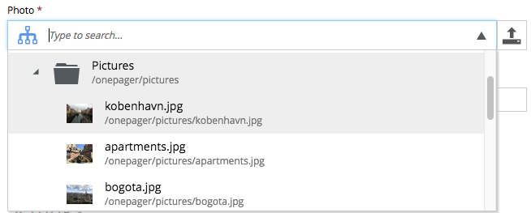
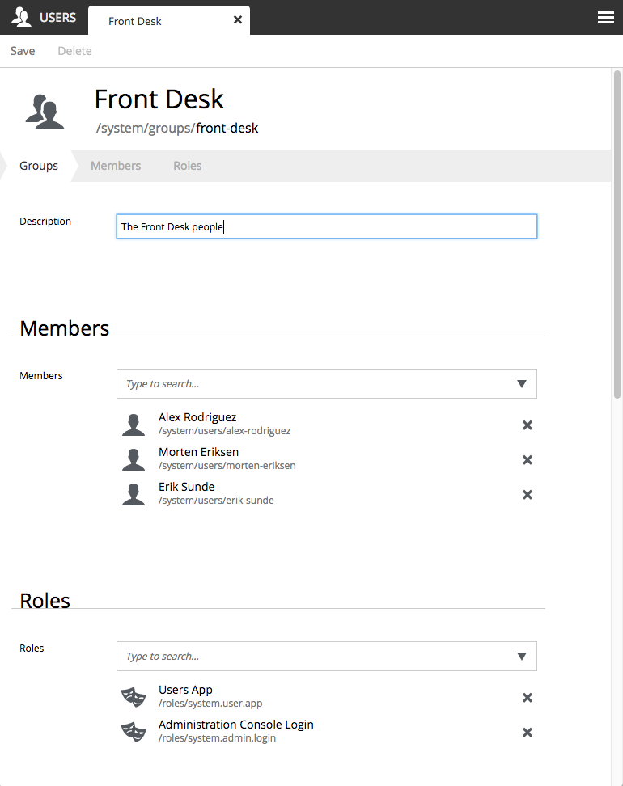
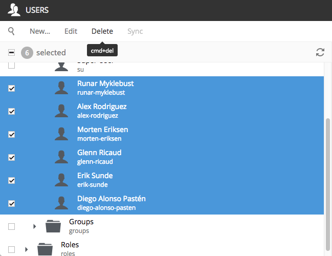

Release Notes
=============

Enonic XP |version| is a minor release with exciting new features, improvements and fixes.

Multi-lingual Admin
-------------------

6.11 opened up the possiblity of localizing admin and most phrases were translated to Norwegian to demonstrate this.
5 more translations have since been added, and the admin console may now be used in seven languages.
The new ones are: French, Spanish, Portuguese, Russian and Swedish.
The language used by Enonic XP to render the admin pages is based on the settings in your browser.
If the language of your choice is not supported by XP, admin will default to English.

A special thanks goes to Paulo Vitor Merlo de Andrade, who contributed the Portuguese translation.
Translations to other languages are greatly appreciated.  Check out how to contribute here: :ref:`language_contribution`.

Content and image selectors may browse tree structure
-----------------------------------------------------

The content and image selectors have gained a "tree" icon on the left hand side.  Clicking this icon will turn it blue, and the dropdown
box with the available choices will switch to a tree structure, so it is possible to look up the content or image in a known location:

  The tree icon has been clicked, in order to look for images in a specific folder.  Notice how the tree icon is blue.

Image Editor gets rotation and flip
-----------------------------------

In the image editor, images may now be rotated and flipped:

  Just the click of a button to rotate an image 90°

  Another click of a button to flip the image around its vertical axis

Rewritten Users App
-------------------

The Users App has been rewritten from scratch using `GraphQL technology <http://graphql.org>`_ to improve performance.
Also, the User Interface have been improved, and there are two new features:  Bulk delete and Roles for Users groups.

  Roles may be added to groups for much improved role management

  Multiple users may now be deleted in one go

Vacuum tool
-----------

The toolbox has a great new tool to save disk space.  The vacuum tool will go through the blob store and physically
delete all object that is no longer in use.

Other improvements
------------------

  * More configuration options for the input types, TextArea, TextLine, Double and Long
  * Support for range header and byte serving for attachments
  * New sanitize function in JavaScript
  * Header shortcuts in HTML Area changed to "Ctrl-Shift-number"
  * Keyboard deletion of selected component in Page Editor and Page Component view
  * Checkbox column in content and image selectors right-aligned

50+ bugs fixed

Changelog
---------
For a complete list of changes and bugfixes see http://github.com/enonic/xp/releases/tag/v6.12.0
