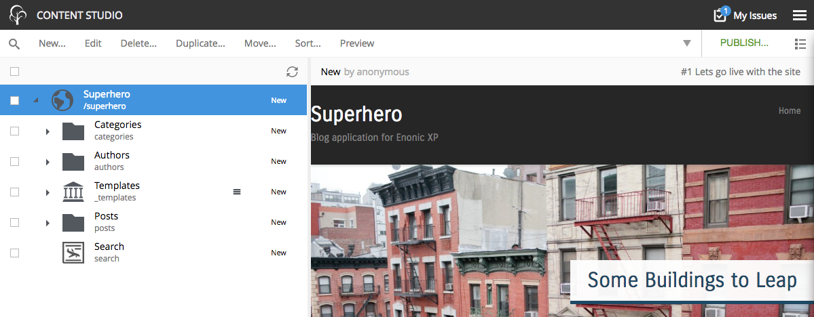
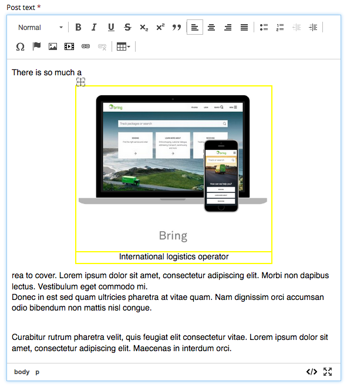
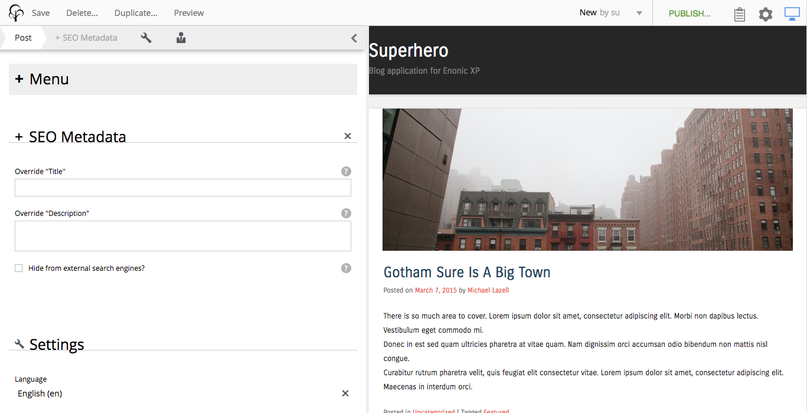
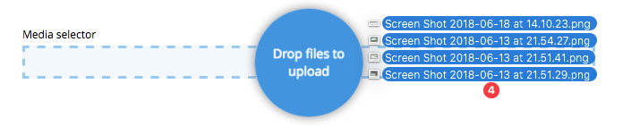
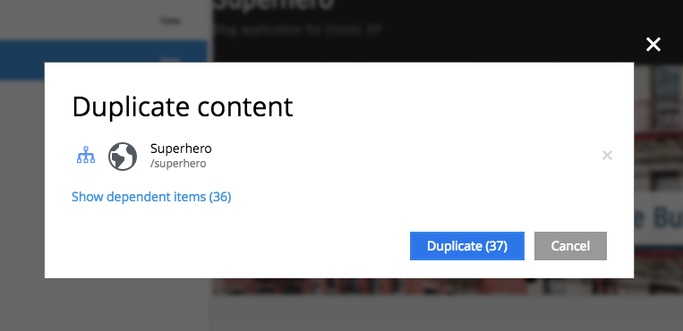

.. _release_notes:

Release Notes
=============

Enonic XP |version| is a release with exciting new features, improvements and fixes.

Improved workflow in Content Studio
-----------------------------------

Issues are now fully integrated in the publishing process of Content Studio.

* Create issues directly from browse view and/or publishing wizard
* Assign and collaborate on issues until they are resolved
* Easily see and access issues your issues
* Easily spot and access issues for an item from preview panel
* Directly open and edit content items from an issue

See the full :ref:`publishing_issues` documentation.

New Html Editor
---------------

As of 6.15 Content Studio uses CKEditor as the default editor, deprecating TinyMCE from service.
The switch improves both stability for editors, and new features, here are a few:

* Drag'n dropping images directly into the editor.
* Drag images around inside text
* Double click to edit both images
* Double click to edit links
* Field expands on select (for faster scrolling through forms)

The editor is fully backward compatible, and more new features will be introduced in upcoming releases.

See the full :ref:`editing_input_types_html` documentation.

Updates to steps in Content Editor
----------------------------------

The standard steps "Settings" and "Access" have been replaced by icons to save space.
Additionally, Xtra data has been re-implemented, and now allows the editor manually enable or disable entire X-data steps.

Editors can now enable, and disable X-data as needed (using the new x-data feature requires a minor change to existing applications).
See the full :ref:`x-data` documentation.

Media Selector input type
-------------------------

A brand new input type for selecting and uploading any kind of file is now available. The Media Selector combines features from both Content Selector and the Image selector to provide a flexible way of uploading and selecting files:

Improved duplicate dialogue
---------------------------

Duplicating content in Content Studio now support selecting to duplicate only a single item, or an entire tree-structure.

Fully replicated sessions
-------------------------

Web sessions (i.e. logins) are now fully replicated.
This means that users will never loose their session if a server is shut down or fails while running an XP cluster.
As of 6.15 sticky-session load balancer configuration is optional.

Other improvements
------------------

* Content type filters for selector inputs now support regular expressions
* Admin extensions are now listed in application details panel
* New Cluster library is available
* x-data now support content type filtering
* Editors may now sort content based on created and publish date
* Link to edit fragments from Inspection panel
* New keyboard shortcuts to publish and preview content
* Support uploading files in Html editor's insert link dialog.
* several other improvements and 90+ bugfixes.

.. warning:: There are important upgrade steps to follow when upgrading to |version|.

:ref:`upgrade_notes` for more details.

Changelog
---------
For a complete list of changes and bugfixes see https://github.com/enonic/xp-distro/releases/tag/v6.15.0
