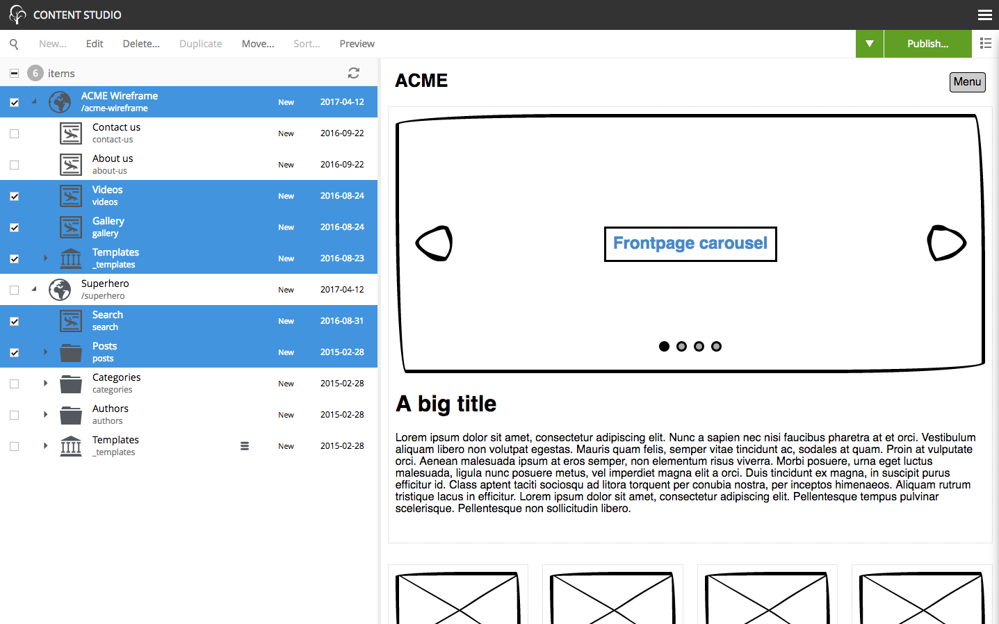
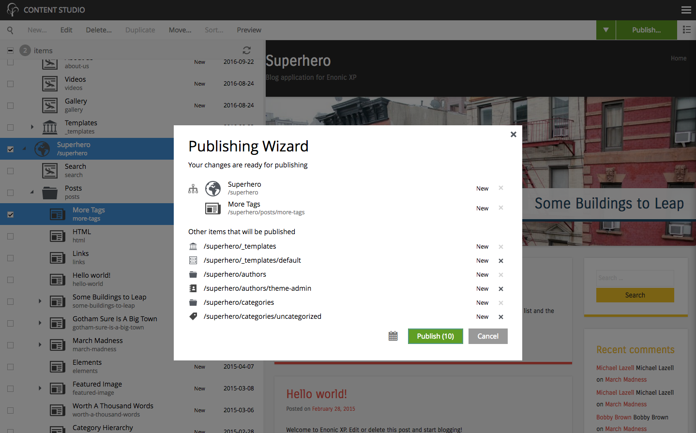
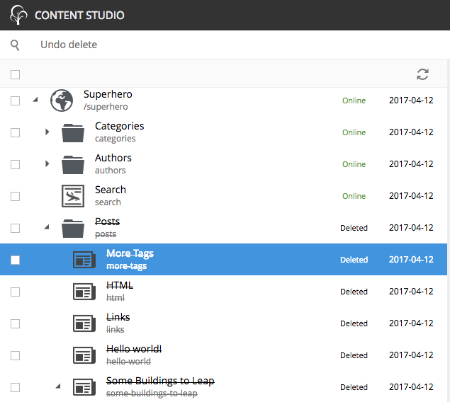
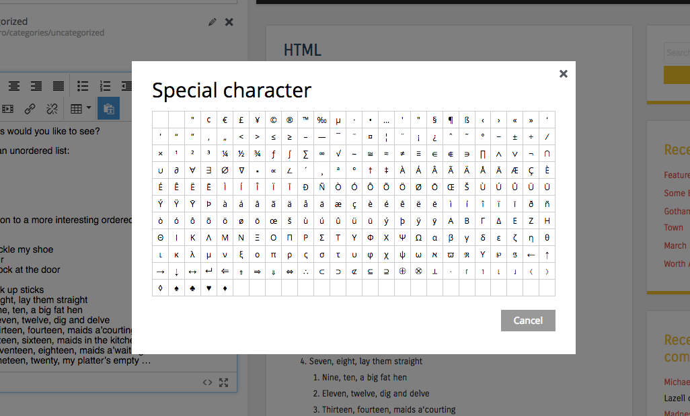

Release Notes
=============

Enonic XP |version| is a minor release with mainly improvements and bug fixes.

Better bulk selection
---------------------
To simplify use and avoid user confusion, the bulk selection mode of XP admin tools have been given an overhaul.
In particular, users have struggled with confusion from selecting too many items, and then performing unwanted delete actions.

Also, showing the bulk selection in the preview area has been removed, so users now alway get the preview of the latest selected item.

  Bulk selection is now easier to use

Improved Publishing Wizard
--------------------------
The publishing wizard has been further improved to allow users to control even more aspects of what is being published:

* Invalid items are now listed at the top of the dependants list
* Any non-parent items can now be removed from the dependants list
* Editors may now choose to publish children (or not) on a per item basis

Check out the :ref:`publish` documentation.

Undo Delete
-----------
The process of deleting content in Content Studio has been improved as follows:

* Users must explicitly confirm deletion of more than one item
* Deleted items will get status DELETED (previously PENDING DELETE)
* DELETED items can now be restored by clicking the 'Undo Delete' button

   Undo delete action

HTML Editor improvements
------------------------
Several updates and improvements have been made the the HTML editor:

* Upgraded to TinyMCE version 4.5.2 (from 4.1.9)
* Find/Replace modal dialog now uses native XP design
* Source modal dialog now uses native XP design
* Special character dialog now uses XP native design
* Text Component was fixed so it no longer creates additional 
 above inserted macro in rendered html

Libraries
---------
* lib-thymeleaf - Added template mode option to render function

Other improvements
------------------

* NEW content status - items that have never been published are now listed as NEW
* New content property: publish.first. Automatically set the first time an item is published
* Applications Installer - It is now possible to search for applications on Enonic Market
* Content Studio - Fragment display name is now listed on the Page Component View
* Implemented trace API and event listeners
* Insert Link dialog - Prevents linking to unrenderable content
* Option Set - Keep input values even if options are de-selected
* Page Editor - "Edit" added to the context menu of image and fragment components
* Automatically updates the details panel when applications are installed, started and stopped
* Changed max header size for requests in Jetty
* Session are now lazy created on first access
* Internal error page will no longer be used if current page produces a body
* Content and image selectors now also support path match in searches
* Move dialog now asks for user confirmation when content is about to be moved out of its site
* Move dialog - Show tree structure inside the content selector
* Page editor now warns user about loosing data when switching from custom page to a page template
* Empty figcaption tag is removed when rendering HTML Area on the server
* Ctrl+click in the Page Editor now acts as right mouse click.
* 80+ bugs fixed

Changelog
---------
For a complete list of changes and bugfixes see http://github.com/enonic/xp/releases/tag/v6.10.0
