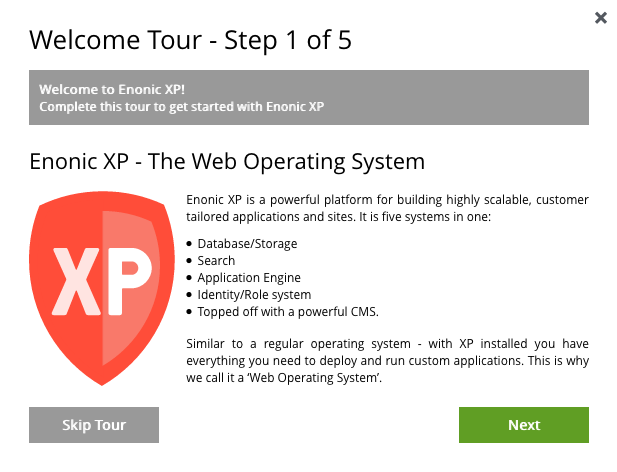
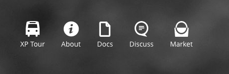
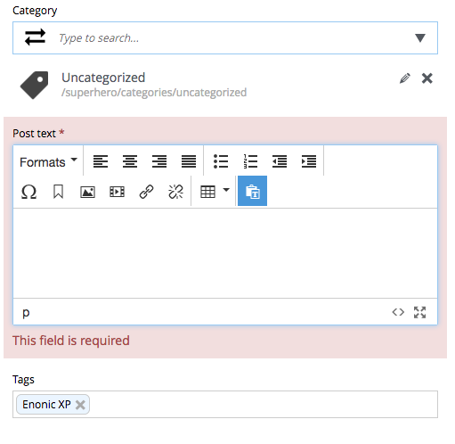
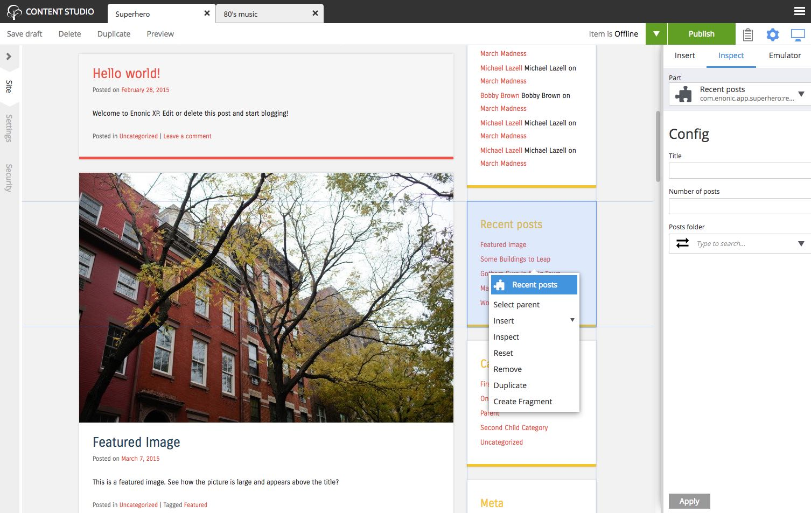
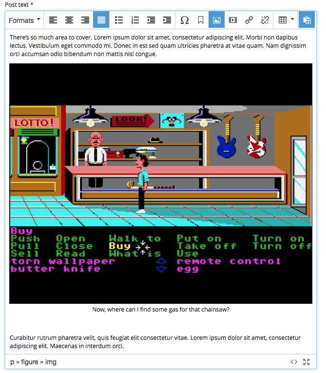
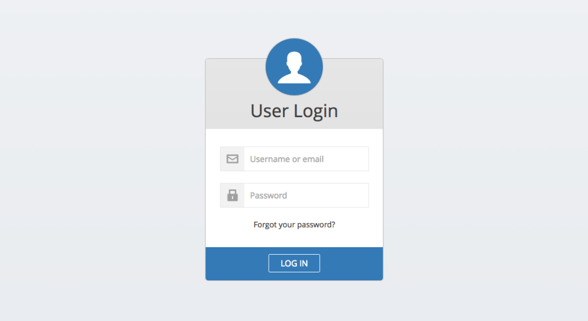

Release Notes
=============

Enonic XP |version| is a minor release with new, with several new features and improvements.

Welcome Tour
------------
The first time you log in to XP, a welcome tour will greet you and finally help you install some interesting applications for testing XP.
The tour is currently only available for Administrators.

Home Screen Shortcuts
---------------------
We have added a few useful links on the home screen, including a new "About" dialogue

Schema Error handling
---------------------
The schema error handling has been polished, and you now get nice and instant feedback in the UI as you proceed through the forms.

Schema Help texts
-----------------
All admin schemas now support help texts per field. Simply add texts to your schemas to get started.

.. image:: images/help.png

CustomSelector input type
-------------------------
Want to pick-and-choose content that does not exist in XP directly from the forms? CustomSelector input type to the rescue!
Configure the CustomSelector to use a customized service to return the results you desire from virtually any source.

This is what it looks like when selecting songs directly form Spotify for instance.

.. image:: images/customselector.png

Check out this tutorial :ref:`custom-selector_tutorial` or visit the :ref:`customselector_type` documentation directly.

Improved Page Editor
--------------------
We just gave the page editor a facelift. It is now easier than ever to see what you have selected and work with pages.
The new design is inspired by the browser inspection panels.

  Clear hightlighting of selected item, and less noise for drag'n drop. Context menu now only appears on right-click.

Boosted HTML Editor
-------------------
The HTML Editor has been improved and now supports custom button configurations - from nothing to everything.
Also, the editor now always has a footer bar with document path inspector, source mode and fullscreen mode.

Application Icons
-----------------
Applications now support adding the icon locally, so the icon will be visible from the various Admin tools.
You may also add a short description in an application.xml.

.. image:: images/application-icons.png

User profile object
-------------------
Building on the IDprovider feature introduced in 6.6.0, we now introduce thew user profile object.
It is in many ways similar to data objects on content. Easily add custom properties to user objects in order to build more sophisticated ID providers.
Currently there are no schemas, but these will be added in future releases.

Properties may also be scoped so it is easy to reuse code from different libraries when building custom IDproviders.
This feature also goes hand-in-hand with the new findUser() function, available in the auth API. Search for users and profile specific properties.

SimpleID provider and LDAP IDprovider (live on the appstore) both utilize the new capabilities.

Check out the documentation on how to build custom :ref:`id_providers`

Speed Improvements
------------------

* Publishing wizard dialog now supports lazy loading to handle large datasets better
* Publishing process speed has been greatly improved for large datasets.
* Content browse panel is more performant and makes few'er requests to back-end
* Tabs in Content Studio now open much faster, and support lazy loading

Libraries
---------

* Auth Library - New findUser() function
* Content Lib

  * refresh() function to force refresh of index
  * refresh() parameter added to contentLib.create(), default is true

* Context Library - Run scope now supports role modification

Minor improvements
------------------

* Toolbox API endpoint has been moved to a new path, separating it more clearly from /admin
* Simplify management with custom credentials for system:su user in system.properties
* Adjustable label placement for checkbox input type
* Controller mappings now support URL parameters
* SVG is now supported for inserting as image in the html editors

Changelog
---------
For a complete list of changes and bugfixes see http://github.com/enonic/xp/releases/tag/v6.7.0
