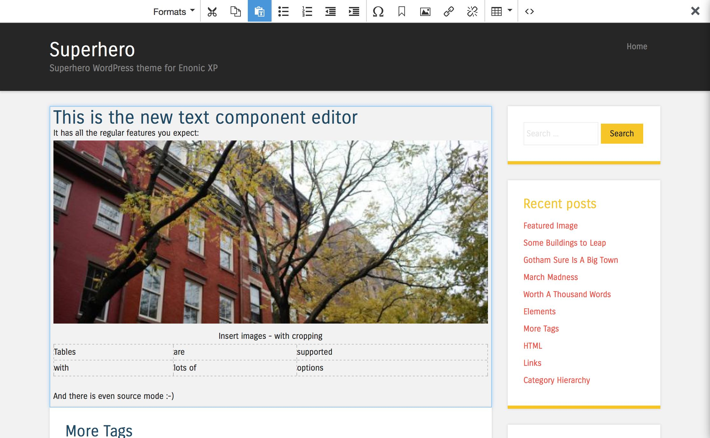
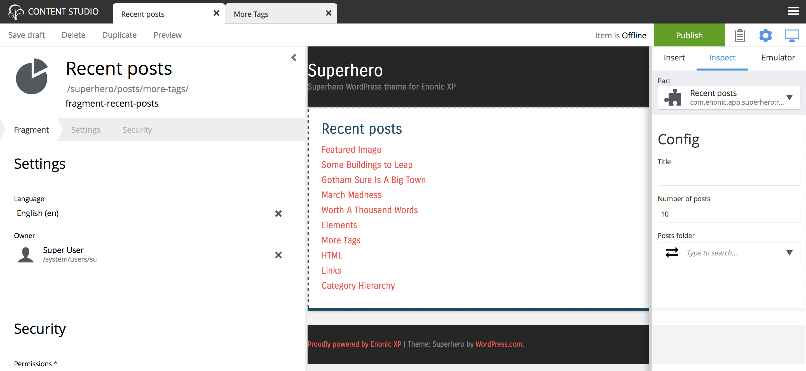
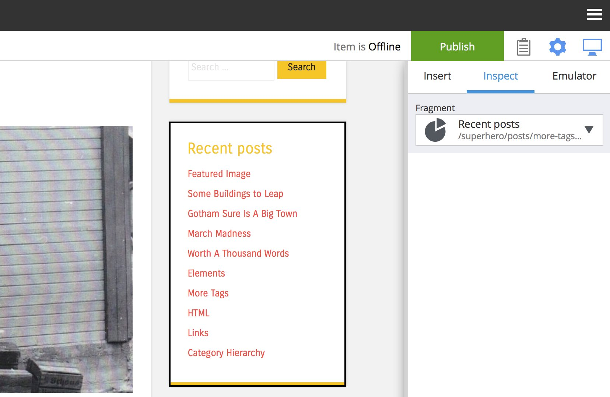
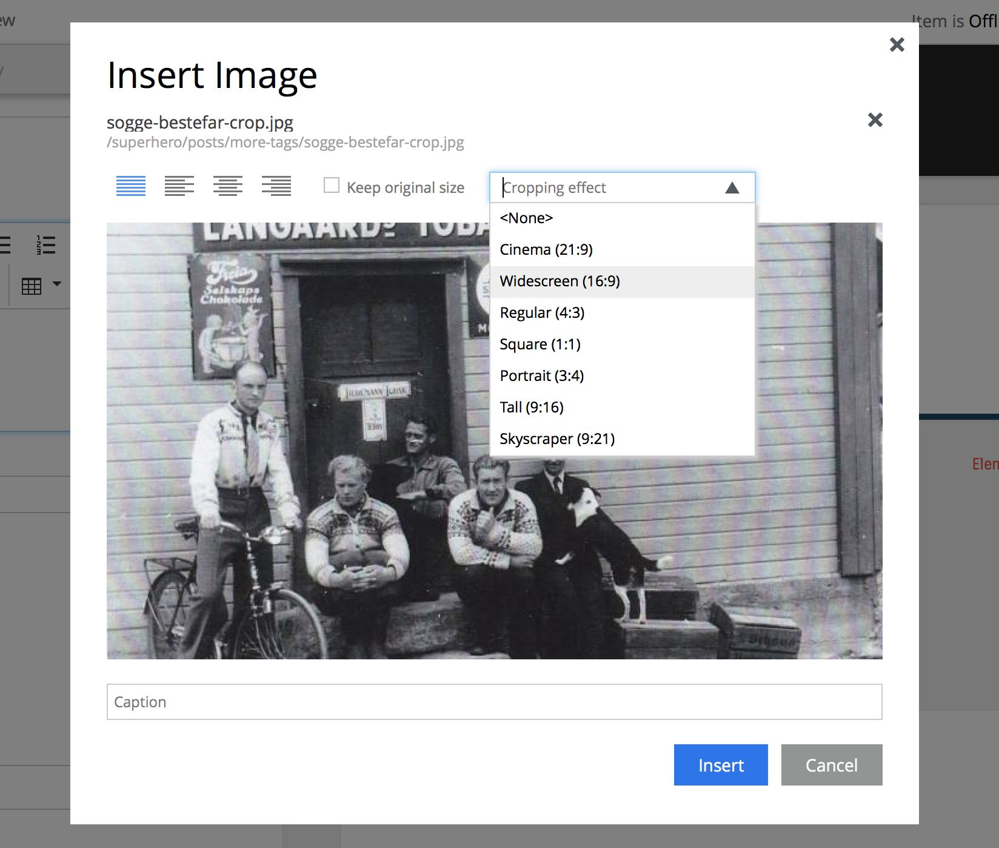
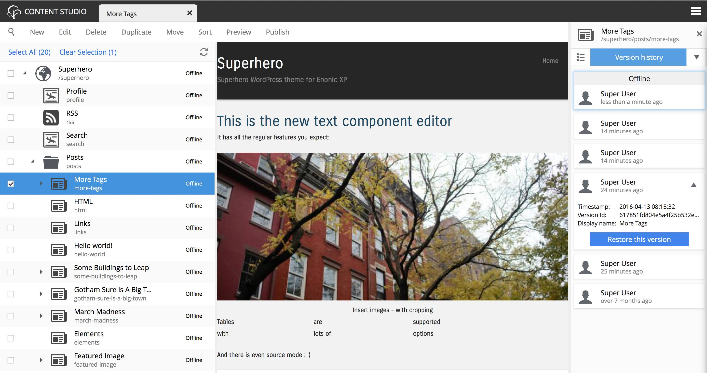

Release Notes
=============

Enonic XP |version| is a minor release, with cool new feature and many improvments and fixes - there are no breaking changes

Enonic XP installers
--------------------
A new download page is now available, providing native installers for OSX and Windows.
The installers bundles Java Runtime Environment (JRE) and as such simplifies testing of Enonic XP greatly.
Developers are still recommended to use traditional Java installation as building applications will require access to the Java Development Kit (JDK)

Enonic XP installation docs :ref:`getting_started_guide`

.. image:: ../../getstarted/images/install-mac.jpg

New Text Component Editor
-------------------------
The Page editors Text component has finally been aligned with the htmlArea.
It now provides all the powerful text editing capabilities you expect, such as tables, images, special characters, source mode and more.
It is also more visually pleasing with a traditional ribbon at the top that can be exited easily by clicking the top right close icon.

Page Fragments
--------------
Wouldn't it be nice if you could create a component once, and re-use it across pages and templates? Well now you can!
Thanks to the new concept of "fragments", any single component (parts, texts, images and even layouts) can be converted to fragments.
A new content type "portal:fragment" is available with this release, so when a component is converted to a fragment it is actually created as a separate content item.
This means you can manage access control for it, and publish at will - just like page templates or other content items.

To get the optimal visual appearance when editing fragments you will have to implement a controller mapping that handles standalone fragment rendering (read about this below).

   Edit fragments just like any other page

   Fragments can be inserted on multiple pages

Inline image crop
-----------------
The html editors now supports pre-defined image sizes and automatic cropping on insert.
The sizes are Cinema (21:9), Widescreen (16:9), Regular (4:3), Sqare (1:1), Portrait (3:4), Tall (2:3) and Skyscraper (9:21)

Version history restore
-----------------------
Content Studio UI now supports rollback (and rollforward) in a documents history.
Simply restore a selected version and publish it!

Controller mapping
------------------
Until now, rendering of sites have required a 100% content driven approach,
meaning you would have to create some content item in the path for anything to be rendered (with the exception of /_/services and /_/components).
Also if a content did exist a page template or controller would have to be configured editorially first.

With controller mappings, developers can statically declare url patterns or content matches that will be triggered without any editorial setup:

* Pattern example: pattern /mycontroller - if the request matches the path pattern, a defined javascript controller will be invoked
* Content match example: match myproperty: "somevalue" - if the content in path matches, a defined javascript controller will be executed

Read more about  :ref:`controller_mappings`

Default values for input types
------------------------------
To speed up form population, the following input types now support default values:

* TextLine
* TextArea
* Long
* Double
* Checkbox
* ComboBox
* HtmlArea

Libraries
---------

* Portal Library - New function url() to create statically defined url's

Minor improvements
------------------

* Marketplace installer UI now handles unlimited number of items
* Progress bar for marketplace installer while downloading
* Cleaned up presentation of htmlArea toolbar (aligned with new text component)
* More robust valueTypes conversion in forms i.e. from dateTime to date
* Added description field to users, groups and roles
* Support for pressing keys Y and N in close wizard dialogue
* Publishing dialogue - enable opening invalid items directly

Changelog
---------
For a complete list of changes see http://github.com/enonic/xp/releases/tag/v6.5.0
