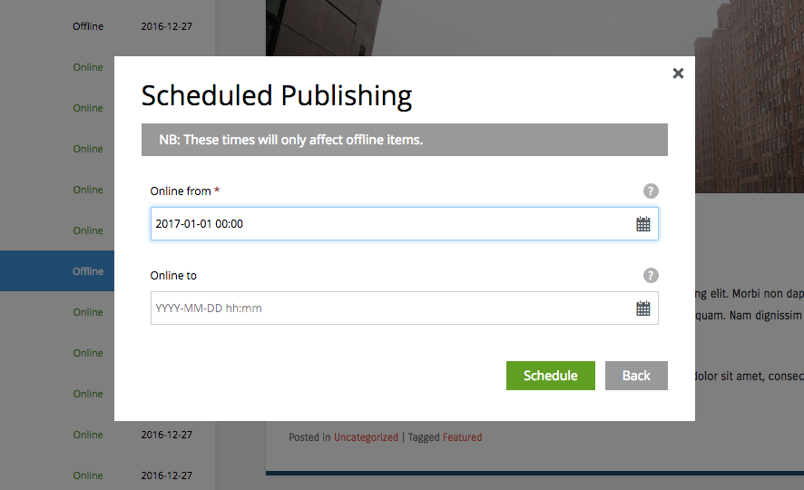
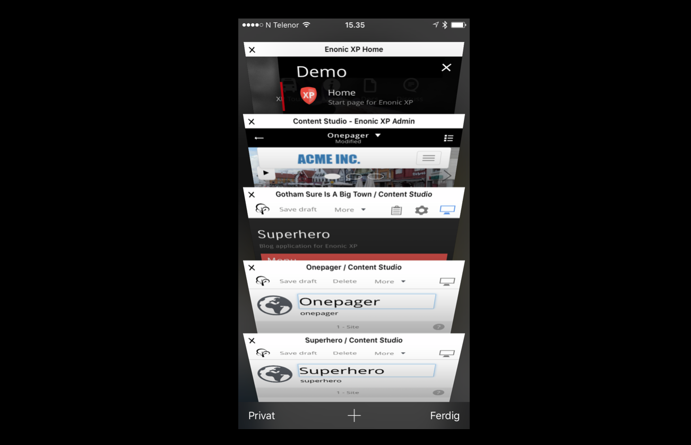
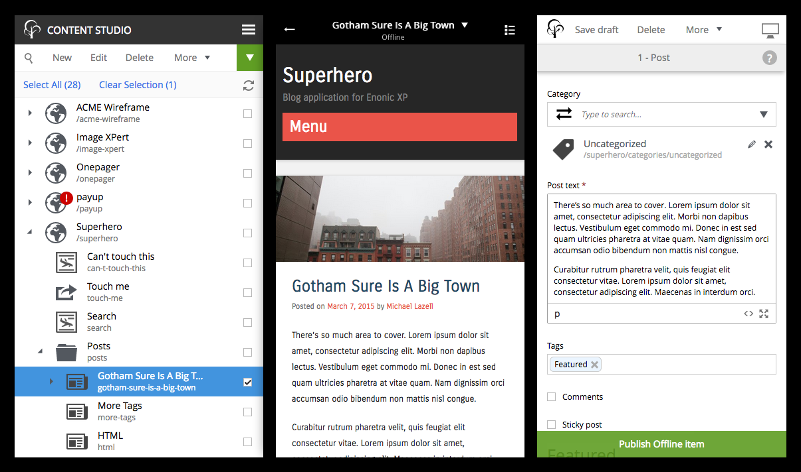

Release Notes
=============

Enonic XP |version| is a minor release with new features and improvements.

Node and Repository API
-----------------------
This feature marks a massive milestone for XP, giving developers direct access to the low-level node API for persisting application-specific domain data.

Basic capabilities compared to SQL:

* Powerful search and aggregation capabilities
* Supports hierarchy, branches, item-level access control, versioning and blobs.
* No transaction concept, but you may use branches to simulate transactions
* Optimized for high-performance read-intensive applications
* Suitable for large data volumes including user-generated content.

NB! For write mostly use-cases such as logging we recommend you to consider other storage options that may be better suited for the task.

.. figure:: images/repoxplorer.png

   Screenshot from the Repo XPlorer app which will be available on Enonic Market soon

* Read more about nodes and repositories :ref:`node_domain` documentation.
* Javascript API documentation :ref:`js-libraries` documentation.

Time-based publishing
---------------------
6.9 introduces the first version of time-based-publishing. This allows editors to schedule when new content goes online. Expiration date may be set for any content.
Future versions will also support scheduling of modifications, deletes and move operations.

Check out the :ref:`publish` documentation.

Native Tabs
-----------
To improve usability, screen real-estate and performance we have split Content Studio into two - the browse view and the editor.
When editing items, each item will now load in a separate native tab similar to how Google Docs and Office 365 works.

* Native tabs eliminates the need for "tabs in tabs", providing more screen real-estate and better tab handling
* Improved loading times as less content must be downloaded for each view
* Better stability - possible to reload a single editor, where the old solution would loose all other tabs when reloading Content Studio.
* Deep linking and loading of a single editor is also much faster.
* Easy navigation as native tabs now shows the name of content being edited plus icon

.. figure:: images/native-tabs.png

   Native tabs in Desktop browsers

   The benefit of native tabs has proven extremely beneficial when working with small screens.

Mobile UI Improvements
----------------------
The mobile interface has several new usability improvements

* Use of native tabs frees up space and simplifies navigation and speed
* Content Studio navigation view has an updated layout and more intuitive navigation
* Content Editor preview has been improved to leave more space for the content
* Sleek transitions between panels

Libraries
---------

* event-lib - Adds support for listening to Java events using Javascript files
* repo-lib - Enables creation and deletion of repositories for isolated storing of nodes using Javascript
* node-lib - Create and manipulate nodes directly from Javascript

Minor improvements
------------------

* CMS Expert Role - Users must be in this role to access HTML editor source mode
* Content Grid - Dim content items for users with read-only access
* main.js - If available, the resources/main.js file is executed when the application is started
* Site Configuration permissions check - Only Administrators or users with the "Content Admin" role can add/remove or edit applications on a site.
* Caption, Artist and Copyright inputs have been added to the Vector media type
* Configuration files can now be loaded from multiple paths, simplifying config overriding for instance
* Better handling of page errors in the preview panel
* Support for JSON in require statements
* File extensions are removed by default from media display names
* 50+ bugs fixed

Changelog
---------
For a complete list of changes and bugfixes see http://github.com/enonic/xp/releases/tag/v6.9.0
