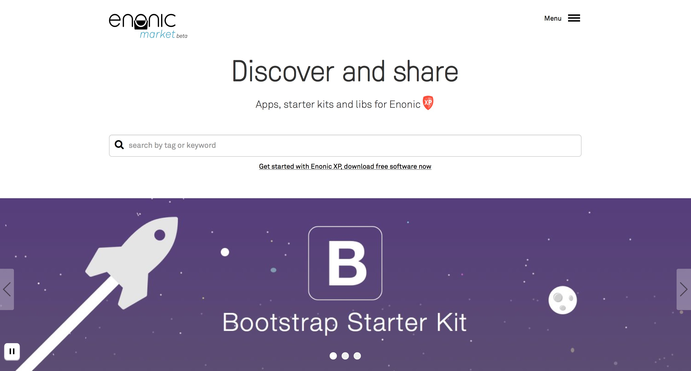
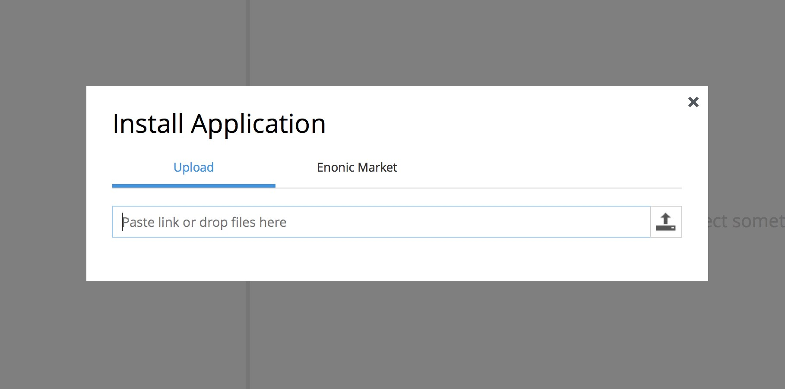
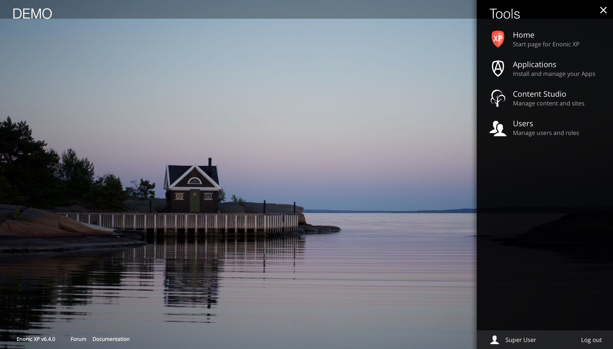

Release Notes
=============

Enonic XP |version| is a minor release, with several exiting new feature and fixes - there are no breaking changes

Enonic Market
-------------
Enonic Market is now available, indirectly a part of Enonic XP - providing easy access to applications, libraries and starters built by
Enonic or other 3rd party vendors. Market applications can even be installed directly from XP. Check it out: https://enonic.com/market

New App installer
-----------------
Applications can now be installed directly from the "Applications" admin tool.
This applies both to local application files, and applications shared in the Enonic Market.
For clustered installations, applications will automatically be distributed and started on all cluster nodes!
The system still supports local deployments. Local deployments will override apps installed centrally - i.e. for development or testing purposes.

Application configuration is still handled on file.

Read more about :ref:`gradle_deploy_app`

Pluggable Admin Tools
---------------------
Enonic XP now supports 3rd party admin tools - (previously admin apps). Each tool is now running in a separate browser tab,
allowing developers to pick and choose their favorite front-end technology.
Read the documentation for how to get started with :ref:`tools`.

Launcher and Home page
----------------------
The home page is now available as a separate tool, featuring a new tools launcher panel.
The launcher panel is easily embedded in other tools - providing global navigation capabilities.
The home page currently only serves the purpose of being a start page for choosing other tools -
but will provide exiting features in upcoming releases.

Contextual Navigation
---------------------
Editors may now navigate directly in the preview area to find what they are looking for, and then click edit.
The content navigation panel (to the left) will update selection as the user navigates the site.

Reference Search
----------------
It is now possible to search for incoming and outbound references.
All references within a document are now automatically indexed in the virtual property ``_references``,
making it easy to search for incoming references and outbound references between nodes and content.

Experimental Websocket support
------------------------------
It is now possible to create and use WebSockets in XP apps. This support is experimental and details may change for future releases.
Feel free to test it out and give us feedback so we can implement this the best way. More details on :ref:`websockets`.

Libraries
---------

* lib-content now features a ``publish`` function (push content from draft to master branch)

Minor improvements
------------------

* Improved organizing of development resources for application projects - see  :ref:`project_structure`.
  Developer assets/ libs/ and services/ should now be placed on resources/ root - not within sites/ - see :ref:`upgrading`
* XSLT Transformations support in toolbox import utility (Apply transformation to import XML on a per-node basis)
* New input type - AttachmentUploader - Add attachments directly from a form - see :ref:`input_types`
* New "abstract" property for media:document content types (Enabling presentation/indexing of a document abstract)
* New "tags" property for all media:* content-types (Enables tagging and search across media)
* Usability improvements for page editor - removed shader, faster selections and context menu on right-click
* Page Component - Highlighting with dashed borders and show text extract from text components
* Upgraded to Elasticsearch 1.5.2
* JVM now autoselects memory HEAP size - no longer using fixed default values

Changelog
---------
For a complete list of changes see http://github.com/enonic/xp/releases/tag/v6.4.0
