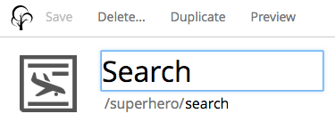
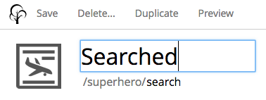
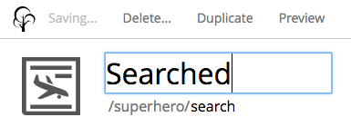
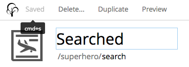
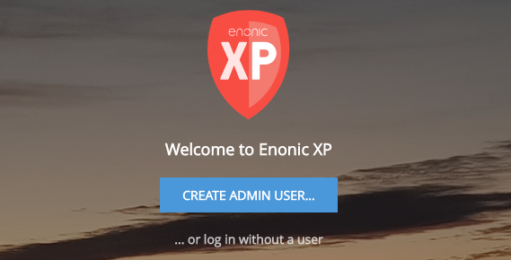
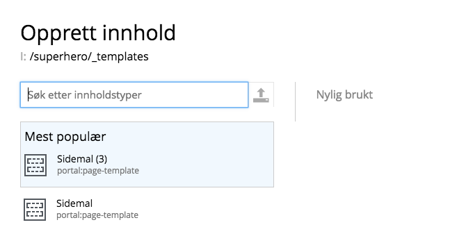
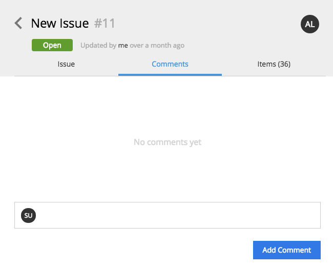

.. _release_notes:

Release Notes
=============

Enonic XP |version| is a release with exciting new features, improvements and fixes.

Improved Save Button
--------------------

The new save button has a more accurate state description:

When a content is openend but has not changed, the save button is unavailable:

After the content is changed, it becomes available:

When clicked, the save button temporary states what is happening:

Finally, the save button is updated to the new state:

New Admin User
--------------

To improve the security, it is no longer necessary to set the admin-user password in a property file.  For new installations, it is instead
set as part of the set-up procedure, where a password is entered before it may be used:

All system content types are localized
--------------------------------------

System macros and content types like Page Template, Folder, Image and more, have been included in the localization system, so they are
now displayed in each users native language, as shown here, where a Norwegian User will choose a "Sidemal" instead of a Page Template:

Components may be detached from Fragments
-----------------------------------------

It has been made possible to detach components from fragments, where the fragment have grown too complex.  This is both possible
directly on the fragment, and from the Page Editor view.

Publishing Issue Comments
-------------------------

When publishing content and passing the work between different authorized personell, it is now possible to add comments, to improve
internal communication.

Other improvements
------------------

* Auth Lib has been improved with a Delete Principal function
* Users are notified if the repo is in read-only state.
* GraphQL is used for User Stores.
* Permission inheritence is implemented in the Node Lib.
* URL Generation and Context Path Parameters have been added to the Portal Lib.
* several other improvements and 68 bugfixes.

.. warning:: There are important upgrade steps to follow when upgrading to |version|.

:ref:`upgrade_notes` for more details.

Changelog
---------
For a complete list of changes and bugfixes see https://github.com/enonic/xp-distro/releases/tag/v6.14.0
