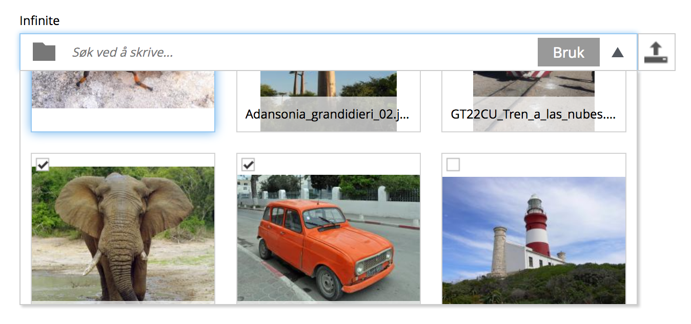
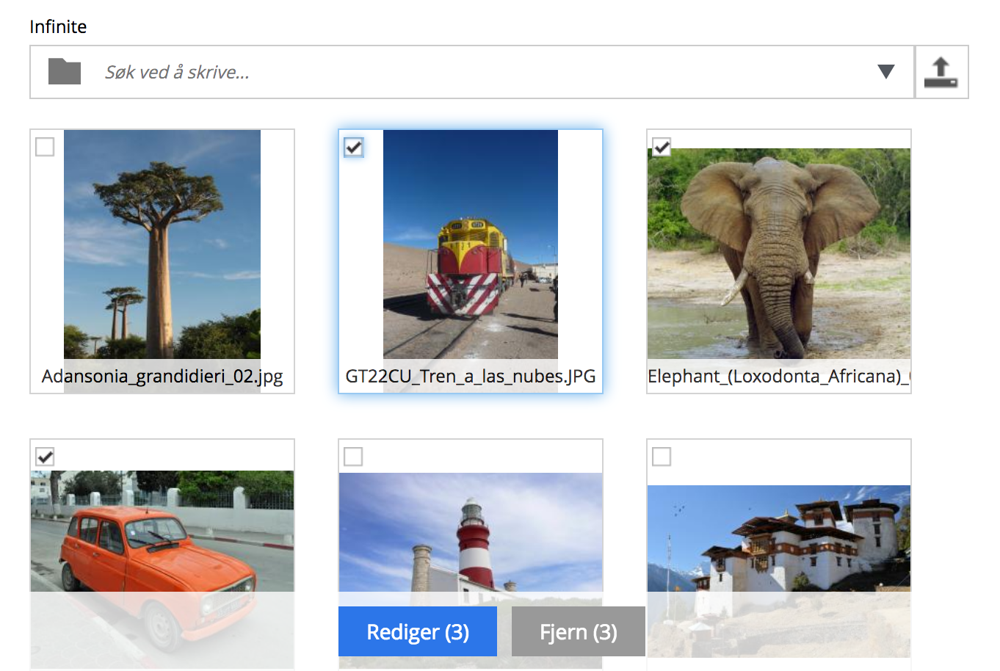
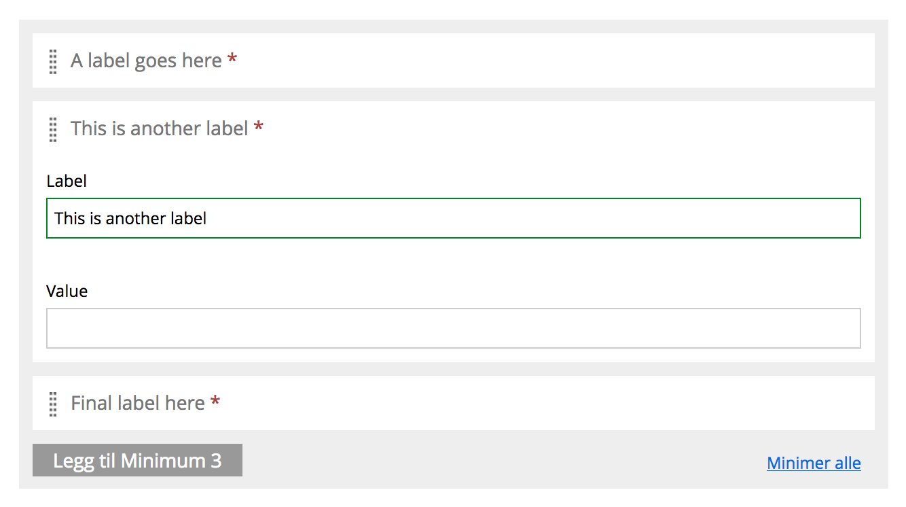
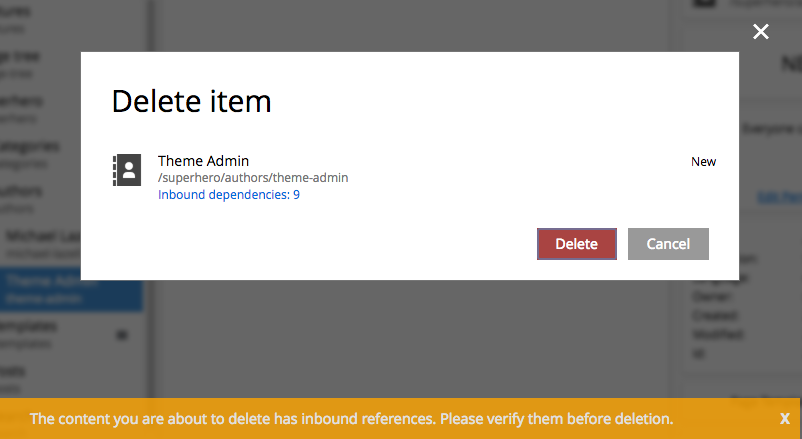

.. _release_notes:

Release Notes
=============

Enonic XP |version| is a minor release with exciting new features, improvements and fixes.

Gallery mode in Image Selector
------------------------------

Based on user feedback, we have implemented a brand new gallery view for the image selector

* Bigger thumbnails making the selection process faster and easier.
* The tree-browsing mode is also available
* Actions for inserted images available in sticky menu

  Search and select images in gallery mode

  Action buttons for selected images are more easily available

Improved UI for ItemSets
------------------------
ItemSet interface has had a makeover to make it easier and faster to use

* Toggle to edit/close a single item by clicking it
* Get instant info on itemSet content from the header
* More consistent icon for drag handle
* Expect further improvements in upcoming releases :)

Warning for inbound references
------------------------------

User is warned when attempting to delete content in Content Studio:

* Lists number of inbound references per item
* Link to quickly access items referencing content

Better indexing of content
--------------------------

Previously, only the content type fields and standard content fields were indexed and searchable.
Now the following fields are also indexed automatically:

* X-data inputs (Steps and fields dynamically added to content)
* Page configuration inputs (editable from context menu)
* Part and layout configuration inputs (editable from context menu)

API improvements
----------------

* Auth lib now supports create and modify role
* Auth lib supports specifying session timeout for logins
* Web server thread pool details now available in status API
* Memory pool details for JVM added to status API
* Events are now sent for task API
* Task thread names can now be set manually
* New "all" keyword available to process all http methods in javascript controllers
* Import, Export and Dump now have progress information available
* ChildOrder setting now configurable in lib-content

Other improvements
------------------

* Page Editor now automatically scrolls to last position after saving
* UI improvements for publishing issues
* Progress bars are now displayed for time consuming move and duplicate actions in Content Studio
* New default icon for custom content types
* "tablet layout mode" with preview panel placed at the bottom of the screen has been dropped
* Content Studio Security step renamed to Access
* Easily clear selections in Content Studio by clicking on blank areas
* + 14 minor improvements and 70 bugfixes

.. warning:: There are important upgrade steps to follow when upgrading to |version|.

  * Stricter default cluster settings
  * Fixes to `event-lib`_ may break compatibiliy
  * Indexing of pages, components and x-data

:ref:`upgrade_notes` for more details.

Changelog
---------
For a complete list of changes and bugfixes see http://github.com/enonic/xp/releases/tag/v6.13.0
