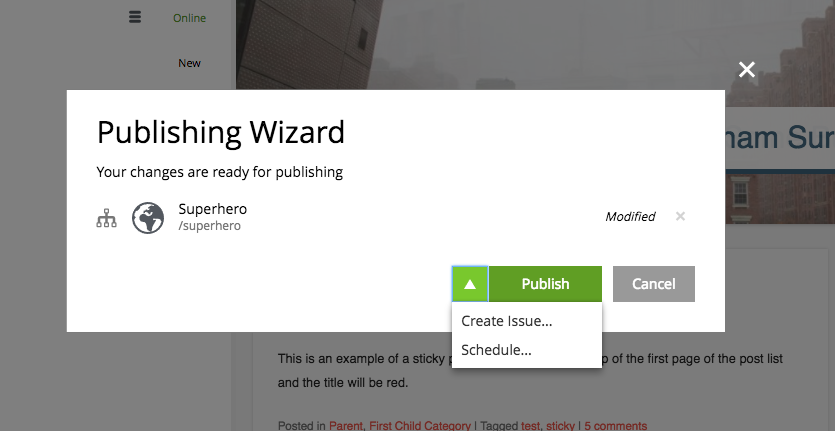
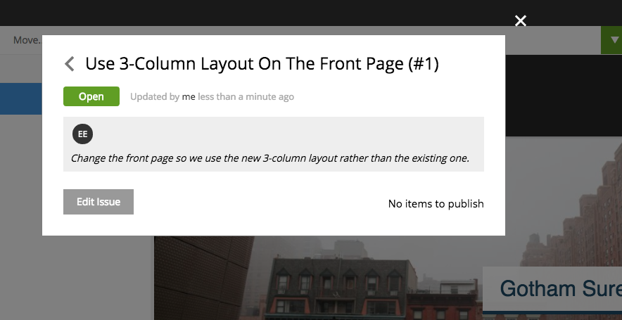

Release Notes
=============

Enonic XP |version| is a minor release with exiting new features, improvements and fixes.

Multi-lingual Admin
-------------------
The XP admin and authoring interface now supports localization. The language will be automatically set based on your browser and OS defined preferences.
This release includes two languages: English and Norwegian, more translations will be added in future releases.

Publishing Issues
-----------------

Inspired by "GitHubs Issues", we have are finally able to reveal the first iteration of collaboration and workflow handling in Enonic XP.

The idea is simple and powerful. Content Studio users now get the ability to create Issues, assign them to other Content Studio editors and contributors,
and optionally add content items to them. With added items an issue can in fact be considered a publishing request.

Content Studio users may even create issues directly from the publishing wizard, as the publishing process and issues nicely blend together.
Users are instantly notified on changes or assignments to issues through e-mails.

  Create issues directly from the publishing wizard

  Details of the created issues

.. figure:: images/issue-list.png

  Browse and find issues

Future versions of XP will extend the concept with features for commenting and tracking of changes to the issue, including single item verification and approval steps.

Dump and Load with versions
---------------------------

Previous versions of XP only supported dumping data without version history, based on the export format.
With 6.11 developers and operations may dump and load entire installations of XP without loosing any data.

License change from AGPL to GPL
-------------------------------

Enonic XP has until now been licensed as AGPL. We are now loosening up the licensing to the more commonly used GPLv3.
In short GPL is similar to AGPL, but AGPL also covers to cloud-based uses of the platform.
With GPL, Enonic XP is aligned with the most popular open source platform projects out there.

All XP libraries (prefixed with lib- in the GitHub project) are licensed under Apache 2.0.
Developers only use these libraries directly when building apps, effectively enabling developers to license their code however they see fit.
Our intention is that the GPL license should only apply to developers that intend to rewrite, modify or extend the core XP platform itself.

Other improvements
------------------

  * Improved detail panel menu and navigation in Content Studio
  * Page Template info displayed in the Details panel
  * Added parameters to Shortcut content type
  * AttachmentUploader - Show placeholder text when no file is selected
  * Implement imagePlaceholder in portal lib
  * Logback - Size and time based
  * Restyle X icon in modal dialogs
  * Support headers in attachments in mail lib

40+ bugs fixed

Changelog
---------
For a complete list of changes and bugfixes see http://github.com/enonic/xp/releases/tag/v6.11.0
