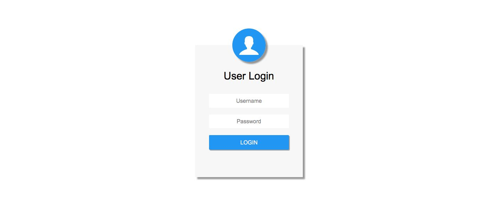
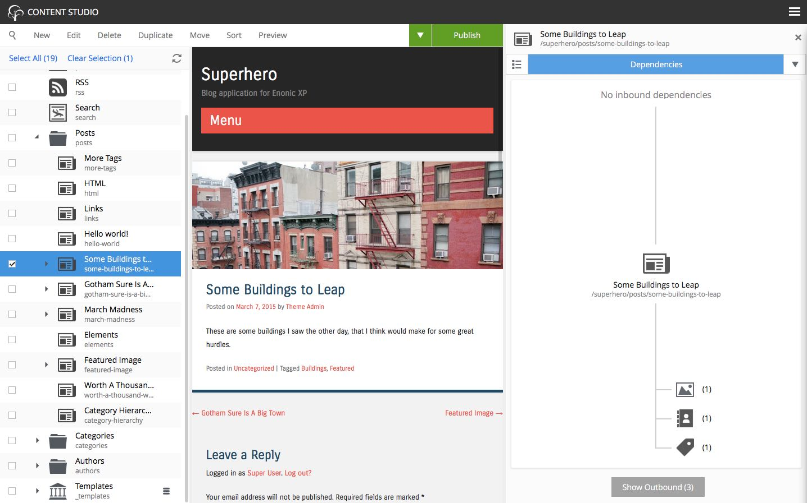
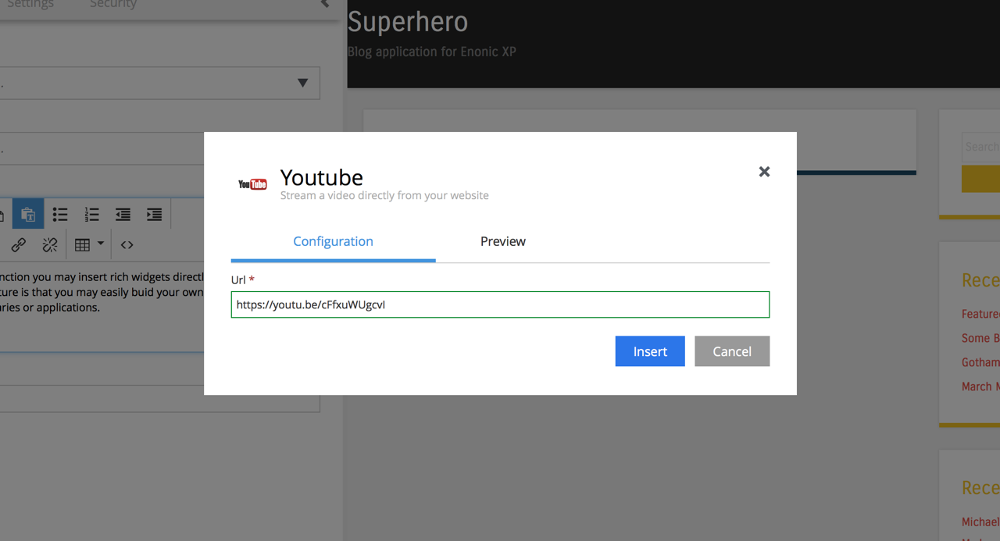
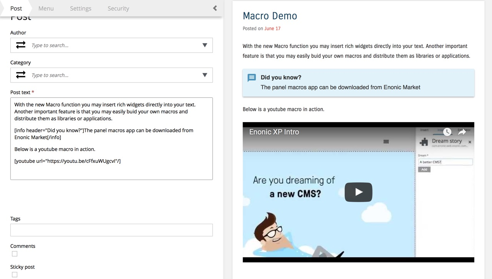
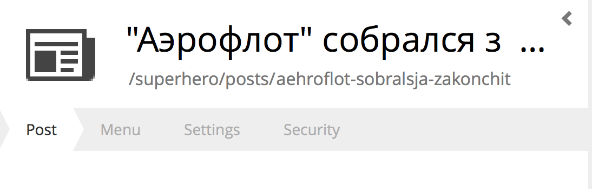
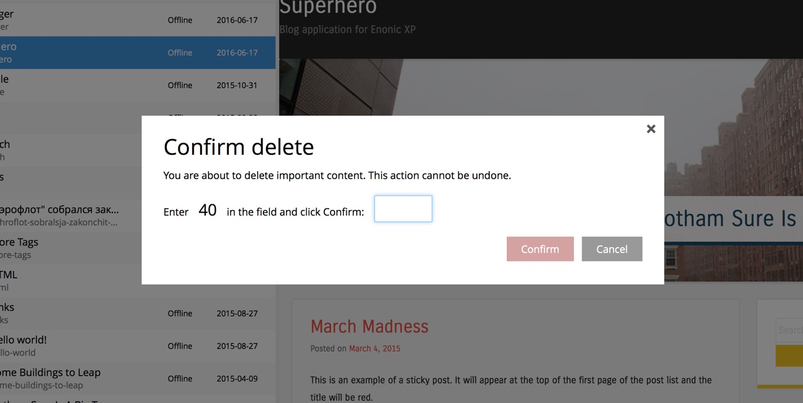

Release Notes
=============

Enonic XP |version| is a minor release with new, amazing features and several improvements and fixes. There are changes related to content studio widgets (experiemental feature) - developers that have created widgets should look into these changes.
Please consult :ref:`upgrade_notes`.

Identity Providers
------------------
We are proud to introduce the first version of de-coupled and pluggable authentication for Enonic XP.
IdProviders are built and supplied as regular applications, and can be added to a userstore and configured - similar to how applications are added to sites.
This configuration can then be mapped to your sites and applications using vhost configurations.
IdProviders will automatically take control for 401 errors (requires authentication) or when explicitly requested by the site.
IdProviders also deliver a standard logout mechanism and autologin features - the latter is particularly useful in SSO environments and intranet settings.

Two new idProvider apps are already live on Enonic Market - namely SimpleIdProvider and Auth0.

Check out the documentation on how to build custom :ref:`id_providers`

Dependency Widget
-----------------
Ever wondered about inbound and outbound references from your content items?
The new dependencies widget panel in content studio lets you easily find and explore both.
This is combined with a new search feature that lets you browse all dependent items in the main content navigator.

Editor Macros
-------------
The HTML editors are now supercharged with support for pluggable macros.
Macros enable you to add rich widgets directly into your text - for example Youtube video's, Info panels, Tweets and just about anything you can think of.
Macros are created and shipped as applications, and can be used simply by adding them to your site.

In addition to the standard macros (disable macro and iframe embed), two macro packs are already live on Enonic Market - namely Panel macros and Social macros, enjoy!

  Easily insert macros using the macro tool

  Youtube and Info macros in action

Name Transliteration
-----------------------------------

Content Studio pretty-url generation is improved with support for transliteration of non ascii characters to a matching ascii character.
Nicer links, less work.

Safe deletes
------------

Content Studio now provides a belt-and-braces approach to bulk deleting, or deletion of sensitive items such as a site.
An extra "Confirm delete" dialogue requires the user to type in the number of items to delete.

   Confirm by typing in the number of items to delete.

Search improvements
-------------------

* Content attachments are now automatically text extracted and indexed. I.e. a pdf document attached to any content can now be searched explicitly.
* Media content utilize the attachment index by adding it to the fulltext search. A regular fulltext search will thus also match text within the uploaded file.
* Finally - text components on pages are also added to the fulltext search, so fulltext search will also match text written within a text component on any given page.

Libraries
---------

* Portal Library - New function loginUrl(), logoutUrl() and idProvider() functions available to fully support IdProviders.
* Auth Library - Made password optional for login (authentication could occur against 3rd party systems in IdProvider instead)
* Http Library

  * Added support for streams
  * Added support for proxy parameter

* Content Library

  * requireValid parameter added to modify function
  * getSite() and getSiteConfig() added
  * createMedia() branch parameter added

Minor improvements
------------------

* Disabled "auto cluster discovery" default setting - Enonic XP now boots in 5 seconds (yes really!)
* Publishing Wizard now supports excluding dependent items in modified state
* Unpublish - Take published items offline without deleting or moving them.
* Instant Delete - Instantly delete published items (skipping pending delete state)
* Improved selector hits - Content and Image selectors now give better and more relevant hits
* Default values for DateTime and GeoPoint input types added
* Client IP added to request object
* New query function - pathMatch to boost items closer to a defined path
* Usage Data Collector added - XP will provide anonymized usage data to Enonic (can be disabled)
* Reindex now gives feedback on progress
* Users Tool: Role description is now displayed in preview
* Upgraded Thymeleaf view template processor to version 3 (faster and better)

Changelog
---------
For a complete list of changes and bugfixes see http://github.com/enonic/xp/releases/tag/v6.6.0
