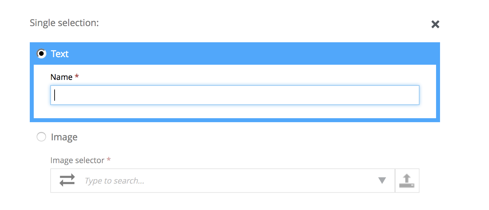
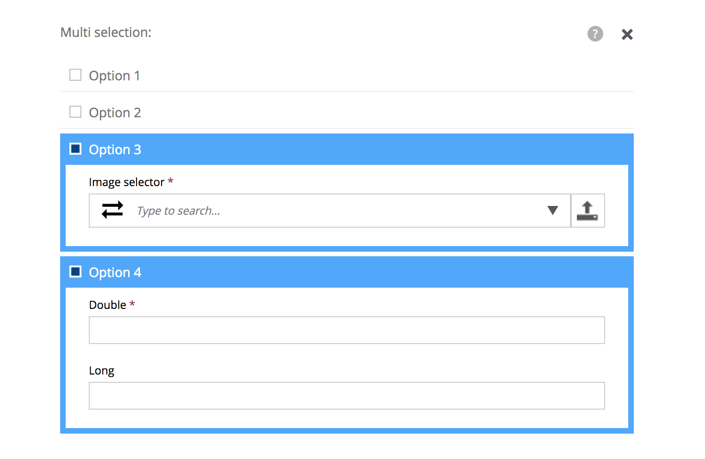
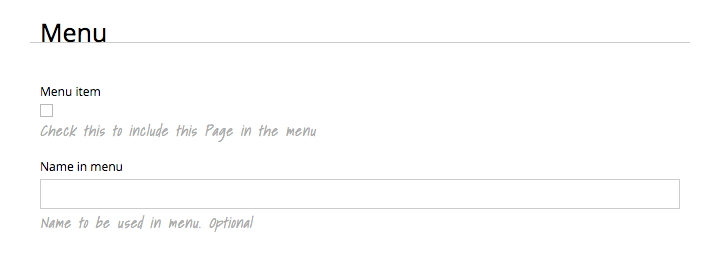

Release Notes
=============

Enonic XP |version| is a minor release with new features and improvements.

OptionSet Form Item
-------------------
This new form item enables fast creation of conditional fields in a schema.
Use optionSet to create more advanced forms by allowing the editor to select between the different options
- for instance "big article" or "small article" or choose between different types of links such as "content link", "download link" or "external link".
OptionSet also allow selecting two or more options at once.

Check out the :ref:`option_sets` documentation.

Expandable Help texts
---------------------
Help texts can now be shown/hidden for an entire form, or for a single input

Metrics Endpoint
----------------
System monitoring is now easier than ever as users can access detailed information about the system through the /status endpoint.
Some of the things that are exposed are:

* cluster
* index
* jvm (GC, threads, memory, etc)
* metrics
* osgi
* server

Asynchronous Task API
---------------------
The Task API enables developers to initialize background tasks, get progress of the task and all other tasks running in the cluster.
A task will run both Javascript and Java code. Each task will be started as a separate thread.

Check out the Javascript library :ref:`js-libraries` documentation.

Global App configuration
------------------------
All applications can now easily be configured by adding a file named <application-name>.cfg in the config directory.
The configuration is automatically accessible to both Javascript and Java code.
Updating a configuration file will automatically restart the corresponding app, injecting the new configuration.
The configuration files must be in standard properties format.

Libraries
---------

* http-lib - added support for basic auth
* Content Lib

  * refresh() function to force refresh of index
  * refresh() parameter added to contentLib.create(), default is true

Minor improvements
------------------

* Macros - HTML document is now added to macro context, allowing you to create macros such as Table of Contents.
* Schemas - Checkbox input type can now be aligned - for instance left to create nicer form layouts
* Schemas - Custom selector now supports passing of parameters
* Application lifecycle handling - Disposer will be executed when applications are stopped
* Javascript error handlers now support post processing
* Content Studio - preview improved user experience for mobile users
* Page editor - highlighting page component when mouse over for better usability
* Publishing wizard - Shows progress for long running tasks (using the task API)

Changelog
---------
For a complete list of changes and bugfixes see http://github.com/enonic/xp/releases/tag/v6.8.0
