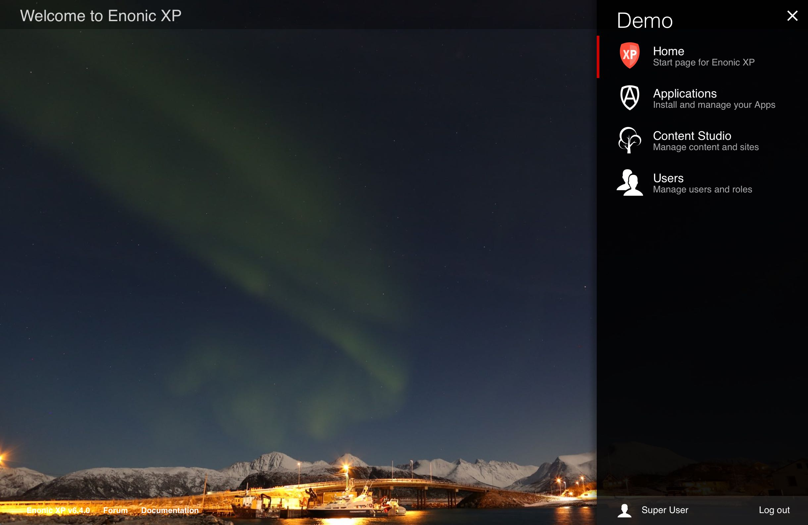

.. _tools:

Admin Tools
===========

.. WARNING::
  Admin Tool support is experimental.

Admin Tools are independent "back office" user interfaces designed to manage Enonic XP or installed applications.
Each tool will run in it's own browser tab - here are some of the reasons for this:

* Faster user interfaces and better deep-linking support
* Developers can use their favorite front-end frameworks
* Simplified debugging

**Standard Tools**

Enonic XP ships with the following tools by default:

* Home (The default tool)
* Applications (Install, stop, start and uninstall applications)
* Content Studio (Create and manage content and sites)
* Users (Create, setup and manage users, groups and roles)

**Launcher**

Navigation between the various Admin Tools is done via the "Launcher Panel", Accessible from the top right corner.
This icon and the Launcher panel should be available across all Admin Tools.

To create a new Admin Tool, you must create a new folder in your project structure, i.e.  ``admin/tools/[tool-name]``.
Then you must place a descriptor, an icon and a controller there.

Descriptor
----------

The tool ``descriptor`` defines the basic info to be displayed in the launcher and which roles are required to access the tool.

The descriptor file must have the same name as the tool, i.e. ``admin/tools/[tool-name]/[tool-name].xml``:

.. literalinclude:: code/descriptor.xml
   :language: xml

Icon
----

You should add an SVG icon to the tool. This will be displayed in the launcher panel together with the info from the descriptor.
The icon file must have the same name as the tool, i.e. ``admin/tools/[tool-name]/[tool-name].svg``:

Controller
----------

To drive the tool, we will need a **controller** (See :ref:`http_controllers`). The controller typically produces the initial tool html.
Depending on the tool implementation it may also handle sub-requests from the tool.

The controller must have the same name as the tool, i.e. ``admin/tools/[tool-name]/[tool-name].js``:

.. literalinclude:: code/controller.js
   :language: javascript

Adding the Launcher Panel menu
------------------------------

Adding the Launcher Panel menu to a custom admin tool requires a few extra steps. The view file must include a JavaScript CONFIG object and
the launcher.js file from the built-in XP admin UI app. The controller file below shows two parameters with the required values and the
view file below shows how to use them.

.. literalinclude:: code/controller-menu.js
   :language: javascript

The two script elements must be placed in the <body> of the view page. The CONFIG appId must match the name of the admin tool. This will
work for an app named "system-info".

.. literalinclude:: code/view.html
   :language: html

